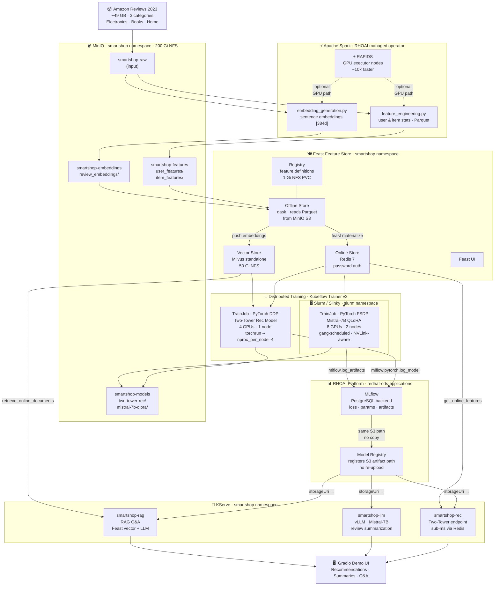

# SmartShop AI: Production ML at Scale

Reference implementation for the Red Hat Summit 2026 presentation on production ML at scale.

Demonstrates **PyTorch Distributed**, **Kubeflow Trainer**, **Apache Spark** (+ RAPIDS GPU acceleration), **Feast Feature Store**, **Slurm**, and **MLflow** on **Red Hat OpenShift AI** through a realistic e-commerce use case.

## What It Does

SmartShop AI is a production e-commerce platform that:

1. **Recommends products** using a PyTorch two-tower model trained on purchase/rating history (DDP on K8s)
2. **Summarizes reviews** using a fine-tuned Mistral-7B (QLoRA + FSDP on Slurm)
3. **Answers product questions** via RAG over review embeddings stored in Feast's vector store

## Architecture

See [docs/SETUP.md](docs/SETUP.md) for the full setup guide, component rationale, and storage layout.



## Why This Scales

### Numbers that matter

| What | How much |
|---|---|
| Raw dataset processed by Spark | **49 GB**, ~571M reviews across 3 categories |
| ETL speedup with RAPIDS on A100s | **~10×** faster — same SparkApplication YAML, zero code change |
| GPU parallelism — recommendation model | **4 GPUs × 1 node**, PyTorch DDP (`torchrun`) |
| GPU parallelism — LLM fine-tuning | **8 GPUs × 2 nodes**, PyTorch FSDP via Slurm gang scheduling |
| Mistral-7B full fine-tune GPU RAM | ~112 GB — impossible on a single A100 |
| Mistral-7B with QLoRA (r=16) | **~24 GB** — fits on one A100, adapter is ~1% of model size |
| Feature lookup latency at serving time | **< 1 ms** — Redis online store, pre-materialized per-user |
| KServe endpoint scaling | **0 → 5 replicas** via HPA, target 80% CPU utilization |
| Storage copied between pipeline stages | **0 bytes** — MinIO is the single source of truth throughout |

### Design choices that make it production-grade

**Single storage layer, no copies.**
MinIO is the only data store. Spark writes Parquet there → Feast reads from there → training jobs read from there → MLflow artifacts land there → KServe serves from there. There is no ETL-to-training copy step, no training-to-serving model upload, no separate artifact store.

**Zero training/serving skew.**
Feast feature views are defined once in `feast/feature_repo/features.py`. The exact same schema used to build the training dataset via `feast materialize` is used at inference time via `get_online_features`. There is no separate "prod feature logic" that can drift from training.

**FSDP needs gang scheduling — Slurm delivers it.**
Multi-node FSDP requires all worker pods to start simultaneously with topology-aware placement (NVLink within node, InfiniBand between nodes). Kubernetes Job scheduling doesn't guarantee this. Slurm does. The Kubeflow Trainer TrainJob dispatches to Slurm via the Slinky operator — `sbatch` under the hood, Kubernetes API on top.

**QLoRA makes LLM fine-tuning accessible.**
Fine-tuning all 14B parameters of Mistral-7B requires ~112 GB of GPU RAM. QLoRA freezes the base model weights and trains low-rank adapter matrices (r=16, ~70M parameters). Memory drops to ~24 GB. The adapter checkpoint is ~270 MB vs ~28 GB for a full fine-tune. Training time drops proportionally.

**RAPIDS is purely additive.**
The RAPIDS variant (`spark-application-rapids.yaml`) uses the same Python feature engineering code. The only change is the executor image, which replaces CPU JVM workers with CUDF/RAPIDS GPU workers. If GPU nodes aren't available, fall back to the CPU SparkApplication — the output is identical.

**MLflow → Model Registry → KServe: zero re-upload.**
MLflow logs model artifacts to `s3://smartshop-models/<run-id>/`. The RHOAI Model Registry registers a pointer to that exact S3 path — no copy. KServe reads `storageUri: s3://smartshop-models/<run-id>/` at pod startup — no copy. The same bytes written during training are what the endpoint serves.

**Slurm workers default to zero replicas.**
GPU nodes are expensive. Slurm worker pods (`NodeSet`) are scaled to 0 when not training. Scale up to 2 nodes for the FSDP demo segment, scale back down immediately after. The Slinky operator makes this a single `oc patch` command.

---

## Quick Start (Local / Sample Data)

```bash
# 1. Install dependencies
pip install -r requirements.txt

# 2. Download sample dataset (~1M reviews, ~500MB)
make data-sample

# 3. Run Spark preprocessing locally
make spark-local

# 4. Set up Feast feature store
make feast-apply

# 5. Train recommendation model
make train-rec

# 6. (Optional) Fine-tune LLM on sample data
make train-llm

# 7. Start serving endpoints (MLflow tracking available at localhost:5000)
make serve

# 8. Launch demo UI
make demo
```

## Full-Scale Run (OpenShift AI)

```bash
# 1. Deploy infrastructure (MinIO, Redis, operators)
make deploy

# 2. Build and push container images
make build-images push-images

# 3. Download full dataset (~49GB)
make data-full

# 4. Submit Spark jobs to cluster
make spark-run         # CPU (default)
make spark-rapids      # GPU-accelerated via RAPIDS (optional, requires GPU executor nodes)

# 5. Materialize Feast features
make feast-materialize

# 6. Submit training jobs (MLflow_TRACKING_URI set in TrainJob env)
make train-rec-k8s    # DDP on K8s
make train-llm-slurm  # FSDP on Slurm

# 7. Deploy serving endpoints
make serve-k8s
```

## Project Structure

```
prod-ml-demo/
├── docs/
│   ├── SETUP.md             # Full setup guide (start here)
│   ├── demo-setup-todo.md   # Phase-by-phase task tracker
│   └── assets/              # Screenshots referenced in SETUP.md
├── data/                    # Download scripts, sample data
├── spark/                   # Spark jobs (feature eng, text preprocessing, embeddings)
├── feast/feature_repo/      # Feast feature view definitions + local feature_store.yaml
├── training/
│   ├── recommendation/      # Two-Tower model + DDP training script
│   └── llm/                 # QLoRA fine-tuning + FSDP config
├── serving/
│   ├── recommendation/      # KServe recommendation server
│   ├── llm/                 # vLLM-based summarization server
│   └── rag/                 # RAG Q&A pipeline (Feast vector search + LLM)
├── pipelines/               # Kubeflow Pipeline (e2e orchestration)
├── demo/                    # Gradio demo UI
├── infrastructure/
│   ├── smartshop/           # Namespace, shared NFS PVC, credentials, Spark RBAC
│   ├── redis/               # Redis deployment + RedisInsight UI
│   ├── milvus/              # Milvus Helm values, deploy script, Attu UI
│   ├── feast/               # Feast FeatureStore CR + secrets
│   ├── mlflow/              # PostgreSQL backend for MLflow
│   ├── openshift/           # SparkApplication, TrainJob, InferenceService manifests
│   └── slurm/               # Slurm Helm values, NFS PVC, sbatch scripts
├── Containerfile.*          # Container images for each component
├── Makefile                 # All build/run/deploy targets
└── requirements*.txt        # Python dependencies
```

## Key Components

| Component | Role | Why It Earns Its Place |
|---|---|---|
| **Apache Spark** | ETL, feature engineering, embeddings | 49GB of reviews can't be processed in pandas |
| **RAPIDS** | GPU-accelerated Spark execution | Same Spark code, 10× faster on A100s — optional but demo-worthy |
| **Feast** | Feature store + vector store | Same features for train/serve (no skew); vector store for RAG |
| **Kubeflow Trainer** | Distributed training orchestration | Two TrainJobs: DDP rec model + FSDP LLM |
| **Slurm** | HPC GPU scheduling for LLM | Multi-node FSDP needs gang scheduling + topology awareness |
| **MLflow** | Experiment tracking | Logs metrics/params/artifacts per run; shares artifact path with RHOAI Model Registry |
| **RHOAI Model Registry** | Model versioning + serving lifecycle | Promotes trained artifacts to KServe; shares S3 artifact path with MLflow |
| **KServe** | Model serving | Three autoscaling endpoints |
| **Mistral-7B** | Review summarization + RAG Q&A | The data IS text; LLM is the natural fit |

## Dataset

- **Amazon Reviews 2023** from McAuley Lab (HuggingFace)
- Categories: Electronics, Books, Home & Kitchen
- Sample: ~1M reviews for local testing
- Full: ~50GB across 3 categories

## Extends

This project extends the [Red Hat AI Quickstart for Product Recommender](https://developers.redhat.com/articles/2026/01/20/ai-quickstart-product-recommender-openshift-ai) by adding:
- Large-scale Spark preprocessing (+ optional RAPIDS GPU acceleration)
- Distributed training with Kubeflow Trainer
- LLM fine-tuning with FSDP on Slurm
- RAG with Feast vector store
- MLflow experiment tracking alongside RHOAI Model Registry
