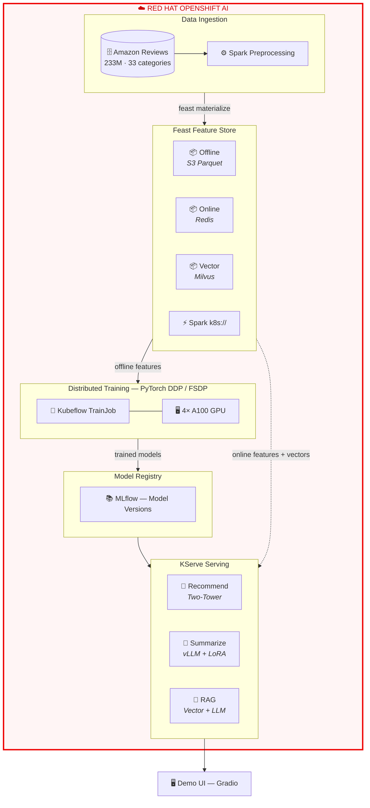
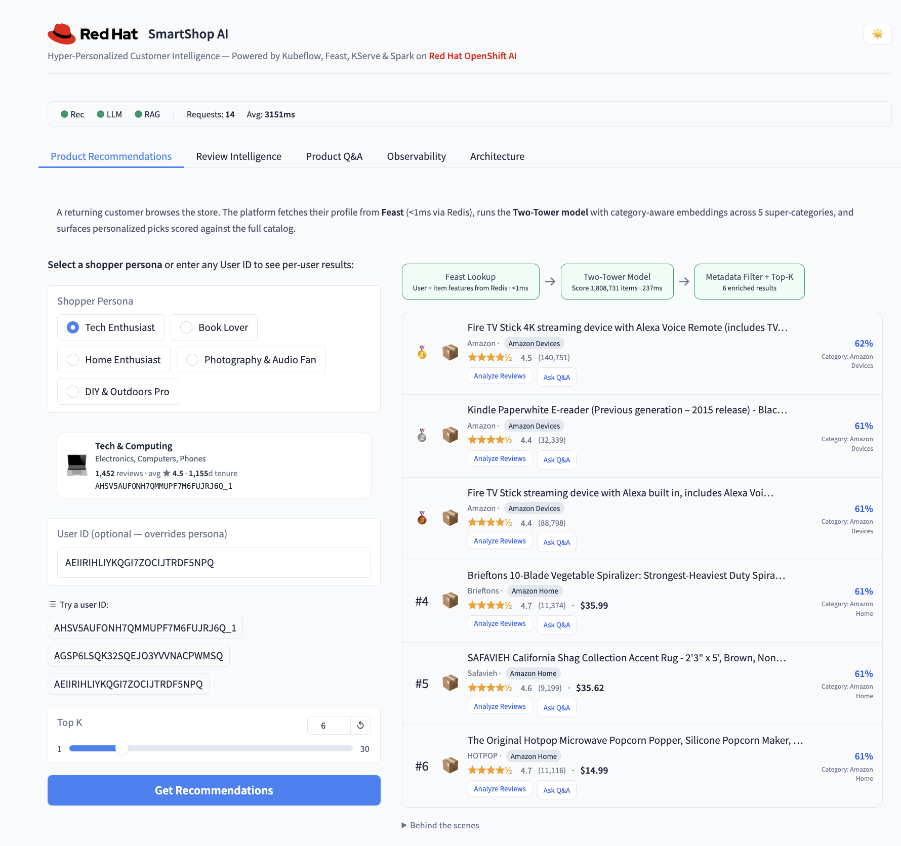
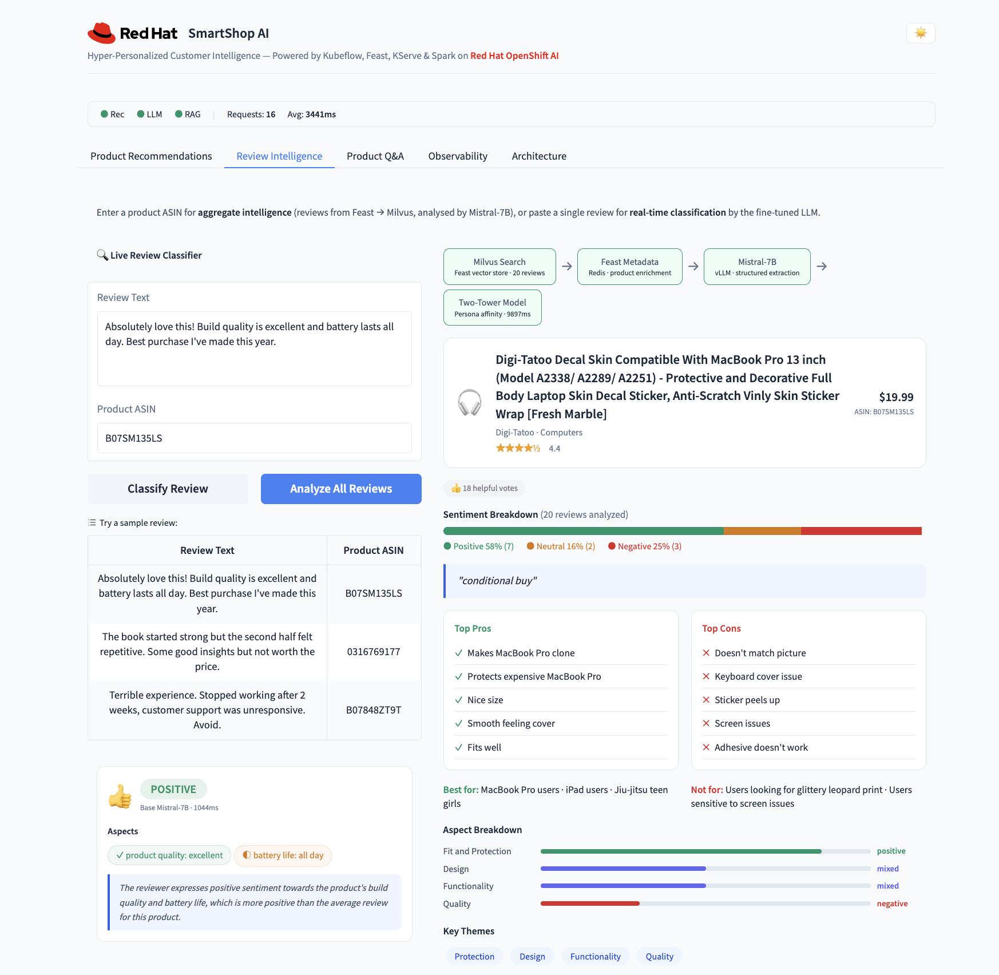
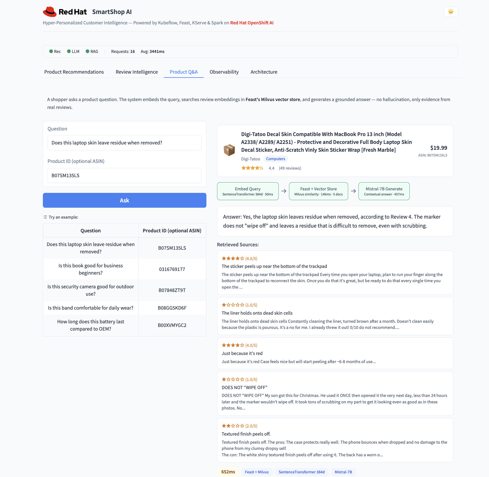
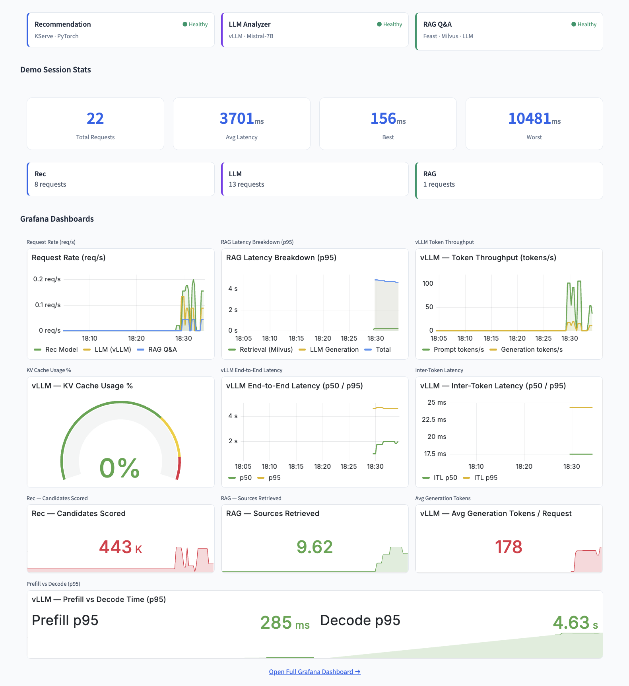
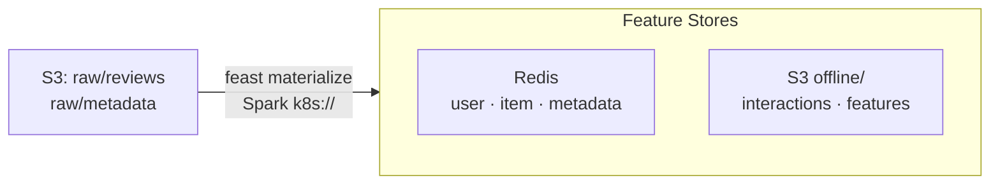
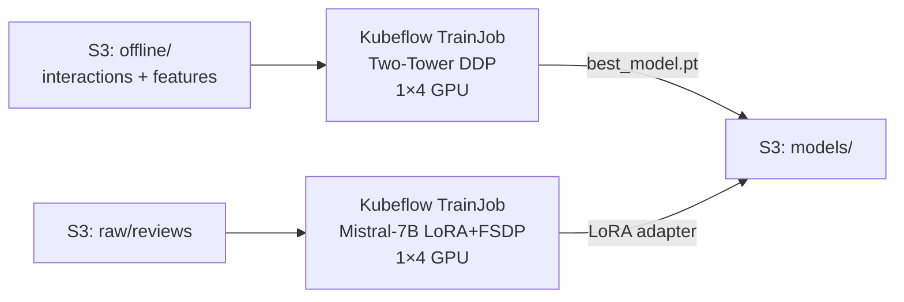
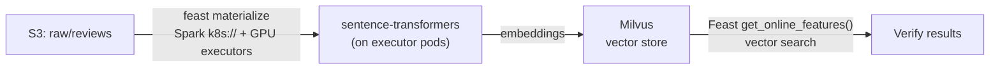
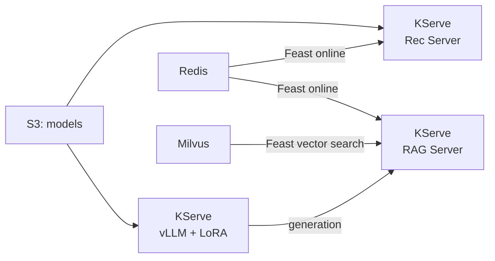
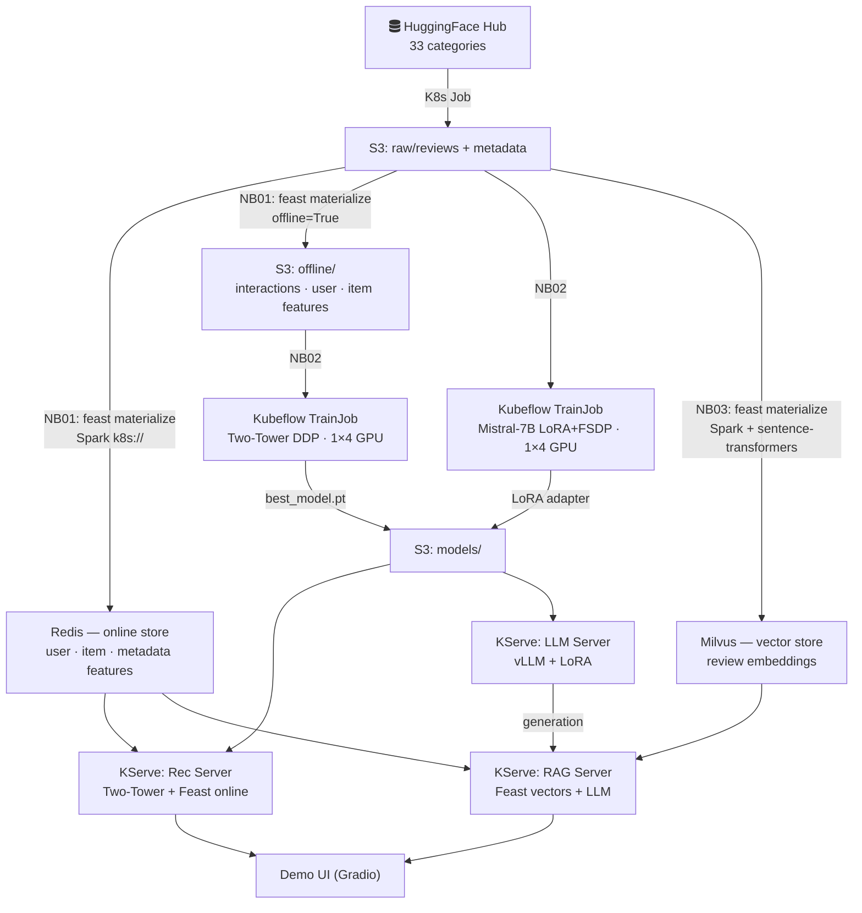

# SmartShop AI

**A production-grade ML platform on Red Hat OpenShift AI** — from raw data to real-time inference, orchestrated entirely on rich industry grade MlOps tech stack.

---

## Why This Exists

Enterprise ML teams face a recurring gap: notebooks work on laptops, but nothing ships to production. SmartShop AI bridges that gap by running the *entire* ML lifecycle — data engineering, distributed training, vector search, and model serving — on the same OpenShift cluster where production workloads run.

**The use case:** an e-commerce platform that recommends products to 4M+ users across 1.8M items, summarizes customer reviews using a fine-tuned LLM, and answers product questions with retrieval-augmented generation — all served at sub-second latency.

## Production Challenges & How We Solved Them

| Challenge | What Happened | Solution |
|-----------|--------------|----------|
| **Training at scale** | Two-Tower model with 4M users × 1.8M items doesn't fit on a single GPU. Training data (5M+ interactions from S3) causes OOM when loaded naively. | Distributed training via Kubeflow TrainJob (PyTorch DDP, 4× A100 GPUs). Rank-0 stages data to shared storage, workers load from disk. HuggingFace Trainer handles gradient sync. |
| **LLM fine-tuning** | Full fine-tuning of Mistral-7B requires ~112 GB VRAM — impossible even on 4× A100 80GB. | LoRA adapters (rank-16) + FSDP sharding across 4 GPUs. Only 0.1% of parameters trained. Adapter stored separately in S3, loaded at serve-time by vLLM. |
| **Feature consistency** | Features computed differently during training vs serving → training-serving skew. | Feast feature store as single source of truth. Same `@batch_feature_view` definitions power both offline (S3 parquet for training) and online (Redis for serving). |
| **Vector search at scale** | RAG needs semantic search over millions of review embeddings with <100ms latency. | Milvus vector database with Feast as the access layer. Embeddings generated by SentenceTransformer on Spark GPU executors, materialized via `feast materialize`. |
| **Spark on Kubernetes** | No YARN cluster — need distributed Spark for feature engineering and embedding pipelines. | Spark `k8s://` native mode. Feast pod acts as Spark driver, dynamically spawns executor pods on the cluster. ConfigMap-based engine config, no external cluster manager. |
| **Model serving lifecycle** | Multiple models (rec, LLM, RAG) with different runtimes, scaling needs, and update cadences. | KServe InferenceServices with custom ServingRuntimes. Rec model served via FastAPI + Feast online lookups. LLM via vLLM with hot-loaded LoRA adapters. RAG chains vector search → LLM generation. |
| **Reproducibility** | Pipeline has 5+ stages with complex dependencies — easy to lose track of what ran and what didn't. | Sequential notebook pipeline (00→04) with a shared `_config.py`. Pre-flight checks validate infra before anything runs. Every notebook documents inputs, outputs, and expected artifacts. |

## Tech Stack

| Layer | Technology | Role |
|-------|-----------|------|
| **Platform** | Red Hat OpenShift AI (RHOAI) | Managed ML platform on OpenShift — workbenches, model serving, operator lifecycle |
| **Orchestration** | Kubeflow Training Operator | Distributed TrainJob submission (DDP, FSDP) with multi-GPU scheduling |
| **Feature Store** | Feast (on OpenShift) | Offline + online feature management. SparkComputeEngine for batch, Redis/Milvus for online |
| **Compute Engine** | Apache Spark (k8s:// mode) | Distributed data processing and embedding generation — no external Hadoop/YARN |
| **Online Stores** | Redis + Milvus | Redis for tabular features (sub-ms lookup), Milvus for vector similarity search |
| **Object Storage** | MinIO (S3-compatible) | Raw data, offline features, model artifacts, LoRA adapters |
| **Model Serving** | KServe | InferenceService abstraction with autoscaling, canary, and multi-model support |
| **LLM Runtime** | vLLM | High-throughput LLM serving with PagedAttention and dynamic LoRA adapter loading |
| **LLM** | Mistral-7B + LoRA | Fine-tuned on 1.4M Amazon reviews for summarization. Base model handles structured extraction |
| **Rec Model** | Two-Tower Neural Net | Category-aware user/item embeddings (PyTorch). Trained on 5M+ interactions via DDP |
| **Embeddings** | SentenceTransformer | Review embeddings for vector search (Milvus) and RAG retrieval |
| **Experiment Tracking** | MLflow | Training metrics, model registry, artifact versioning |
| **Observability** | Grafana + Prometheus | GPU utilization, Redis throughput, training progression, serving latency |
| **Data Source** | [Amazon Reviews 2023](https://huggingface.co/datasets/McAuley-Lab/Amazon-Reviews-2023) | 233M reviews across 33 product categories (~80 GB) |

## Architecture



## Demo UI

A Gradio application with five tabs showcasing the full pipeline:

### Product Recommendations

Two-Tower model scores 1.8M items per user with category-aware embeddings. Persona selector, per-user ID lookup, explainability ("why recommended"), and cross-tab linking to Review Intelligence and Q&A.



### Review Intelligence

Aggregate product analysis: sentiment breakdown, top pros/cons, aspect-level scoring, and "best for / not for" guidance — all extracted by Mistral-7B. Includes a live single-review classifier and LoRA-powered TL;DR summaries.



### Product Q&A

RAG pipeline: user question → SentenceTransformer embedding → Feast vector search (Milvus) → top-k reviews → Mistral-7B generates a grounded answer with cited sources. No hallucination — only evidence from real reviews.



### Observability

Live health checks for all three InferenceServices, session stats, and embedded Grafana dashboards: request rate, RAG latency breakdown, vLLM token throughput, KV cache usage, inter-token latency, and prefill vs decode times.



---

## Prerequisites

- RHOAI workbench in the `smartshop` namespace with FeatureStore connection + S3 DataConnection
- Operators installed: Feast, Spark, Kubeflow Trainer, KServe
- Infrastructure deployed: MinIO, Redis, Milvus, Postgres
- FeatureStore CR, ServingRuntimes, `feast-spark-engine` ConfigMap pre-created by admin
- Environment variables: `AWS_ACCESS_KEY_ID`, `AWS_SECRET_ACCESS_KEY` (via DataConnection)

See [Admin Setup Runbook](#admin-setup-runbook) below for first-time cluster provisioning.

## Pipeline

| # | Notebook | What it does | Time |
|---|----------|-------------|------|
| 0 | `00_setup.ipynb` | Pre-flight checks: infra connectivity (MinIO, Redis, Milvus, Feast), K8s secrets, `feast-spark-engine` ConfigMap, pod readiness | ~1 min |
| 1 | `01_data_pipeline.ipynb` | Sync `feature_repo` to Feast pod → `feast apply` → `materialize_incremental` for `user_features` / `item_features` / `item_metadata` → Redis + S3 offline; then `get_historical_features` writes training parquet to S3 (Spark batch engine) | ~30 min |
| 2 | `02_training.ipynb` | Train Two-Tower rec model (DDP) + fine-tune Mistral-7B (LoRA/FSDP) via Kubeflow TrainJob | ~2 hr |
| 3 | `03_embeddings.ipynb` | `feast materialize` review embeddings → Milvus via Spark + sentence-transformers on GPU executors | ~45 min |
| 4 | `04_serving.ipynb` | Deploy rec, LLM, RAG InferenceServices via KServe + smoke tests | ~10 min |

Run sequentially — each notebook depends on artifacts from the previous one.

## Directory Layout

```
├── .env.example                        # Environment variables template
├── _config.py                          # Shared config (single source of truth)
├── 00_setup.ipynb                      # Pre-flight checks
├── 01_data_pipeline.ipynb              # Feast @batch_feature_view → Redis + S3
├── 02_training.ipynb                   # Rec + LLM distributed training
├── 03_embeddings.ipynb                 # Feast materialize embeddings → Milvus
├── 04_serving.ipynb                    # KServe deploy + smoke tests
│
├── feature_repo/                       # Feast feature definitions
│   ├── features.py                     #   @batch_feature_view: user + item + interactions (→ Redis + S3)
│   ├── features_milvus.py              #   review_embeddings (→ Milvus)
│   ├── feature_store.yaml              #   main config (Spark k8s:// + Redis)
│   ├── feature_store_rec.yaml          #   rec serving config (Redis online only)
│   ├── feature_store_milvus.yaml       #   Milvus online store config
│   └── feature_store_serving.yaml      #   RAG serving config (Milvus online only)
│
├── serving/                            # Model server code
│   ├── recommendation/server.py        #   Two-Tower model + Feast item features
│   ├── rag/server.py                   #   RAG: Feast vector search + LLM generation
│   └── llm/server.py                   #   Local testing wrapper (prod uses vLLM directly)
│
├── build/                              # Container image definitions
│   ├── Containerfile.feast-spark       #   Feast server (PySpark + S3A JARs)
│   ├── Containerfile.feast-spark-executor      # Spark executor (CPU)
│   ├── Containerfile.feast-spark-executor-rapids  # Spark executor (RAPIDS GPU)
│   ├── executor-entrypoint.sh          #   k8s executor entrypoint shim
│   └── requirements/                   #   Pip requirements for training/serving images
│       ├── training.txt
│       └── serving.txt
│
└── manifests/
    ├── infra/                          # Cluster infrastructure (admin one-time)
    │   ├── redis.yaml                  #   Redis + RedisInsight deployment
    │   ├── milvus-values.yaml          #   Milvus Helm values (standalone + S3)
    │   ├── milvus-attu.yaml            #   Attu (Milvus web UI)
    │   ├── milvus-deploy.sh            #   Milvus Helm install script
    │   ├── mlflow-cr.yaml              #   MLflow CR (RHOAI operator)
    │   ├── mlflow-postgres.yaml        #   PostgreSQL backend for MLflow
    │   ├── buildconfigs.yaml           #   OpenShift image BuildConfigs
    │   ├── data-download-job.yaml      #   HuggingFace → S3 download Job
    │   └── service-ca-configmap.yaml   #   OpenShift service CA bundle
    ├── feast/                          # Feature store
    │   ├── feast-operator.yaml         #   FeatureStore CR
    │   ├── feast-spark-engine.yaml     #   Spark engine ConfigMap (k8s://)
    │   ├── feast-spark-driver-svc.yaml #   Spark driver Service
    │   └── feast-materialize-embeddings-job.yaml  # Milvus embedding Job
    ├── training/                       # Model training
    │   └── e2e-notebook.yaml           #   Automated pipeline notebook
    ├── serving/                        # Model serving
    │   ├── serving-runtimes.yaml       #   ServingRuntimes + InferenceServices
    │   └── demo-ui.yaml               #   Gradio demo UI deployment
    └── observability/                  # Monitoring
        ├── grafana.yaml                #   Grafana dashboards
        └── redis-exporter.yaml         #   Redis metrics exporter
```

## Shared Configuration

All notebooks import from `_config.py` — a single source of truth for namespace, endpoints,
secret names, image references, and other shared constants. Change a value once, all notebooks
pick it up. Each notebook adds only its own stage-specific variables on top.

```python
from _config import *   # NAMESPACE, S3_ENDPOINT, REDIS_HOST, MILVUS_HOST, ...
validate()              # initializes K8s config, prints summary, fails fast on issues
```

## Running the Demo

### 1. Open a workbench

Launch an RHOAI workbench (PyTorch image, Large size) in the `smartshop` namespace.
Attach a **FeatureStore** connection (auto-mounts Feast client config) and a
**DataConnection** to MinIO (provides S3 credentials as env vars).

### 2. Pre-flight check (once)

Open `00_setup.ipynb` and run all cells. This verifies:
- Infrastructure connectivity (MinIO, Redis, Milvus, Feast Registry)
- Feast client config is auto-mounted at `/opt/app-root/src/feast-config/smartshop`
- Required K8s secrets exist (`smartshop-credentials`, `feast-s3-credentials`, `feast-redis-secret`, `hf-credentials`)
- ConfigMap `feast-spark-engine` exists
- Feast, MinIO, Redis pods are Ready

### 3. Run pipeline notebooks in order

**Notebook 1 — Data Pipeline**
- Prerequisite: raw data already in S3 (data-download Job run by admin)
- Copies `feature_repo/` to the running Feast pod, runs `feast apply` + `materialize_incremental`
- Feast `@batch_feature_view` UDFs define PySpark transformations inline
- SparkComputeEngine reads raw S3 data, computes features, writes to Redis + S3 offline parquet
- Feature views: `user_features`, `item_features`, `item_metadata`
- Then runs `get_historical_features` via Spark to build training parquet on S3



**Notebook 2 — Training**
- Submits Two-Tower recommendation model training via Kubeflow TrainJob (1 node × 4 GPUs, PyTorch DDP)
- Training reads from Feast-materialized S3 offline parquet (`offline/interactions/`, `offline/user_features/`, `offline/item_features/`)
- Submits Mistral-7B LoRA fine-tuning via Kubeflow TrainJob (1 node × 4 GPUs, LoRA + FSDP)
- Models saved to S3 **before** evaluation to prevent loss on eval failure



**Notebook 3 — Embeddings**
- Sets up a separate Feast repo with Milvus online store config
- Runs `feast apply` to register the `review_embeddings` feature view
- Runs `feast materialize` — Feast's Spark engine reads reviews from S3, runs sentence-transformer inference on GPU executor pods, writes embeddings to Milvus
- Verifies vector similarity search via Feast `get_online_features()`



**Notebook 4 — Serving**
- Deploys `smartshop-rec`, `smartshop-llm`, `smartshop-rag` InferenceServices
- Waits for all three to reach READY state
- Runs smoke tests: recommendation scoring, LLM completion, RAG Q&A with cited sources



### 4. Deploy demo UI

The demo UI requires a separate deployment after all notebooks complete:

```bash
envsubst < manifests/serving/demo-ui.yaml | oc apply -f -
oc rollout status deployment/smartshop-demo-ui -n smartshop
oc get route smartshop-demo-ui -n smartshop -o jsonpath='{.spec.host}'
```

Tabs: Product Recommendations, Review Intelligence, Product Q&A, Observability, Architecture.

## Complete Data Flow



## Admin Setup Runbook

One-time cluster provisioning before users can run notebooks. All commands assume `oc login` to the target cluster.

**First**, source environment variables (all manifests use `envsubst` to inject image refs and config from `.env`):

```bash
cp .env.example .env   # edit with your registry, credentials, etc.
set -a && source .env && set +a
```

### 1. Create namespace and RBAC

```bash
oc new-project smartshop
```

### 2. Deploy infrastructure

| Component | How | Notes |
|-----------|-----|-------|
| **MinIO** | Helm or OperatorHub | Create buckets: `smartshop-features`, `smartshop-models` |
| **Redis** | `envsubst < manifests/infra/redis.yaml \| oc apply -f -` | Password in `smartshop-credentials` Secret |
| **Milvus** | `cd manifests/infra && bash milvus-deploy.sh` | Helm chart + Attu UI |
| **Postgres** | `envsubst < manifests/infra/mlflow-postgres.yaml \| oc apply -f -` | Backend for MLflow |
| **MLflow** | `envsubst < manifests/infra/mlflow-cr.yaml \| oc apply -f -` | RHOAI operator CR |

### 3. Create secrets

```bash
# From .env file
set -a && source .env && set +a

# S3 + Redis credentials
oc create secret generic smartshop-credentials -n smartshop \
  --from-literal=AWS_ACCESS_KEY_ID="$AWS_ACCESS_KEY_ID" \
  --from-literal=AWS_SECRET_ACCESS_KEY="$AWS_SECRET_ACCESS_KEY" \
  --from-literal=AWS_DEFAULT_REGION="${AWS_DEFAULT_REGION:-us-east-1}" \
  --from-literal=REDIS_PASSWORD="$REDIS_PASSWORD" \
  --dry-run=client -o yaml | oc apply -f -

# HuggingFace token (for gated models like Mistral)
oc create secret generic hf-credentials -n smartshop \
  --from-literal=token="$HF_TOKEN" \
  --dry-run=client -o yaml | oc apply -f -

# Service CA ConfigMap (for TLS to Feast registry)
envsubst < manifests/infra/service-ca-configmap.yaml | oc apply -f -
```

### 4. Deploy Feast

```bash
# Spark engine ConfigMap (k8s:// mode)
envsubst < manifests/feast/feast-spark-engine.yaml | oc apply -f -

# Spark driver Service (stable host for executor→driver comms)
envsubst < manifests/feast/feast-spark-driver-svc.yaml | oc apply -f -

# FeatureStore CR (Feast Operator deploys offline/online/registry servers)
envsubst < manifests/feast/feast-operator.yaml | oc apply -f -
```

### 5. Download raw data

```bash
envsubst < manifests/infra/data-download-job.yaml | oc apply -f -
oc wait --for=condition=complete job/smartshop-data-download -n smartshop --timeout=30m
```

### 6. Deploy serving infrastructure

```bash
envsubst < manifests/serving/serving-runtimes.yaml | oc apply -f -
```

### 7. Deploy observability (optional)

```bash
envsubst < manifests/observability/redis-exporter.yaml | oc apply -f -
envsubst < manifests/observability/grafana.yaml | oc apply -f -
```

### 8. Create RHOAI workbench

- Image: **PyTorch** (CUDA), Size: **Large** (8 CPU, 32 Gi)
- Attach **DataConnection** to MinIO (injects `AWS_*` env vars)
- Attach **FeatureStore** connection `smartshop` (auto-mounts Feast client config)
- Install JDK in the workbench (required for NB03 Spark driver — see below)
