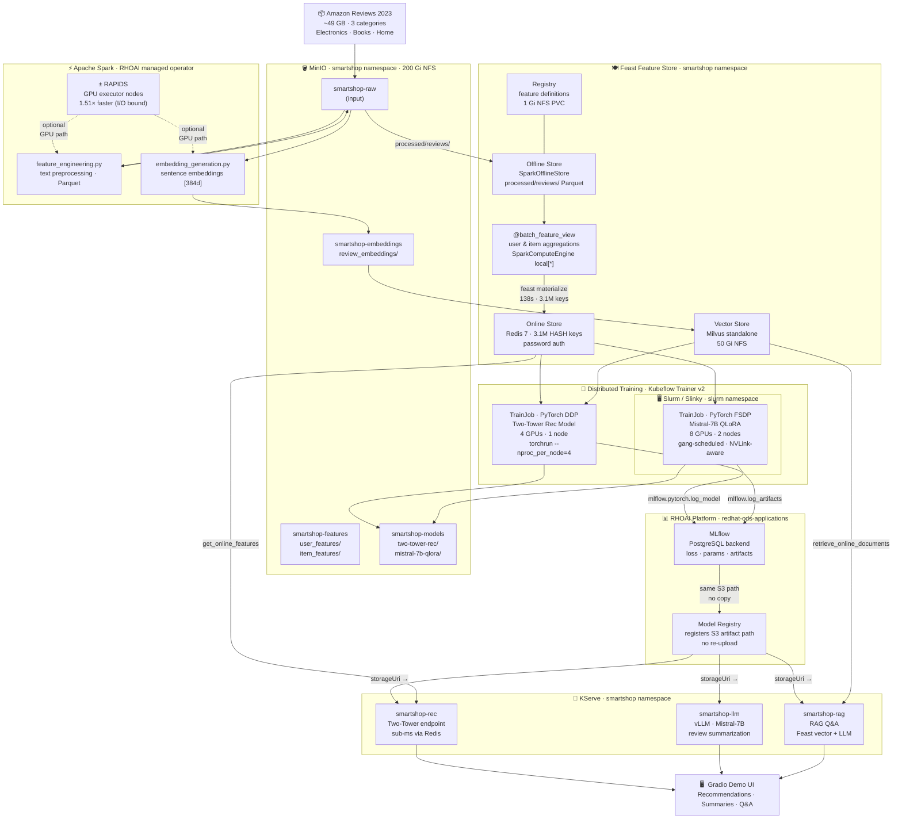

# SmartShop AI: Production ML at Scale

> **Red Hat Summit 2026** — reference implementation for distributed ML on Red Hat OpenShift AI.

This repository is a **fully deployable, end-to-end ML platform** for an e-commerce use case. It is designed for ML platform engineers and data scientists who want to see exactly how production-grade distributed training, feature engineering, and model serving fit together on OpenShift AI — with real infrastructure manifests, real data, and real performance numbers.

**Technologies demonstrated:** PyTorch Distributed (DDP + QLoRA/FSDP), Kubeflow Trainer v2, Apache Spark + RAPIDS GPU acceleration, Feast Feature Store, MLflow, RHOAI Model Registry, KServe.

---

## Who This Is For

| Audience | What you get from this repo |
|---|---|
| **ML Platform Engineers** | Fully working OpenShift manifests for every component — copy, adapt, deploy |
| **Data Scientists** | End-to-end pipeline from raw S3 data to live inference endpoints via Feast + MLflow |
| **OpenShift Admins** | Namespace, RBAC, BuildConfig, and operator configuration reference |
| **Demo Presenters** | See [docs/DEMO-SCRIPT.md](docs/DEMO-SCRIPT.md) for the guided live demo narrative |

---

## What It Does

SmartShop AI is a production e-commerce ML platform that:

1. **Recommends products** using a PyTorch two-tower model trained on 140M purchase interactions (DDP on K8s, 4× A100 GPUs)
2. **Summarizes reviews** using Mistral-7B fine-tuned with QLoRA + FSDP on K8s (4× A100 GPUs)
3. **Answers product questions** via RAG over 104M review embeddings stored in Feast's vector store

## Architecture

See [docs/SETUP.md](docs/SETUP.md) for the full setup guide, component rationale, and storage layout.  
See [docs/DEMO-SCRIPT.md](docs/DEMO-SCRIPT.md) for the step-by-step guided demo narrative.



## Why This Scales

### Numbers that matter

| What | How much |
|---|---|
| Raw dataset processed by Spark | **49 GB**, 140M+ reviews across 3 categories |
| ETL speedup with RAPIDS on A100s | **1.51× overall** (1.74× peak on item aggregation) — I/O-bound on MinIO; compute-bound workloads see larger gains |
| GPU parallelism — recommendation model | **4 GPUs × 1 node**, PyTorch DDP (`torchrun`) |
| GPU parallelism — LLM fine-tuning | **4 GPUs × 1 node**, PyTorch FSDP + QLoRA via Kubeflow TrainJob |
| Mistral-7B full fine-tune GPU RAM | ~112 GB — impossible on a single A100 |
| Mistral-7B with QLoRA (r=16) | **~24 GB** — fits on one A100, adapter is ~1% of model size |
| Feature lookup latency at serving time | **< 1 ms** — Redis online store, pre-materialized per-user |
| KServe endpoint scaling | **0 → 5 replicas** via HPA, target 80% CPU utilization |
| Storage copied between pipeline stages | **0 bytes** — MinIO is the single source of truth throughout |

### Design choices that make it production-grade

**Single storage layer, no copies.**
MinIO is the only data store. Spark writes Parquet there → Feast reads from there → training jobs read from there → MLflow artifacts land there → KServe serves from there. There is no ETL-to-training copy step, no training-to-serving model upload, no separate artifact store.

**Zero training/serving skew.**
Feast feature views are defined once in `feast/feature_repo/features.py`. The exact same schema used to build the training dataset via `feast materialize` is used at inference time via `get_online_features`. There is no separate "prod feature logic" that can drift from training.

**FSDP shards the model across GPUs.**
QLoRA quantizes the base model to 4-bit and trains LoRA adapters. FSDP shards optimizer state and gradients across GPUs. On a single node with 4× A100 80GB, this fits Mistral-7B comfortably. Multi-node FSDP is supported by the training script but not required for the demo.

**QLoRA makes LLM fine-tuning accessible.**
Fine-tuning all 14B parameters of Mistral-7B requires ~112 GB of GPU RAM. QLoRA freezes the base model weights and trains low-rank adapter matrices (r=16, ~70M parameters). Memory drops to ~24 GB. The adapter checkpoint is ~270 MB vs ~28 GB for a full fine-tune. Training time drops proportionally.

**RAPIDS is purely additive.**
The RAPIDS variant (`spark-application-rapids.yaml`) uses the same Python feature engineering code. The only change is the executor image, which replaces CPU JVM workers with CUDF/RAPIDS GPU workers. If GPU nodes aren't available, fall back to the CPU SparkApplication — the output is identical.

**MLflow → Model Registry → KServe: zero re-upload.**
MLflow logs model artifacts to `s3://smartshop-models/<run-id>/`. The RHOAI Model Registry registers a pointer to that exact S3 path — no copy. KServe reads `storageUri: s3://smartshop-models/<run-id>/` at pod startup — no copy. The same bytes written during training are what the endpoint serves.

**Slurm integration is optional.**
Slinky/Slurm is deployed on the cluster but not currently used for training. Kubeflow Trainer does not yet have native Slurm runtime support (upstream issue #2249). Both training jobs run as plain K8s TrainJobs. Slurm workers are scaled to 0 to avoid idle GPU consumption.

---

## Hardware Prerequisites

This demo is designed for Red Hat OpenShift AI on a GPU-enabled cluster. A minimal working configuration:

| Resource | Minimum | Used in this demo |
|---|---|---|
| GPU nodes | 1 node × 4 GPUs | 2 nodes × 8 GPUs (A100-SXM4-80GB) |
| GPU driver | CUDA 12+ | CUDA 13 / driver 580.x |
| Shared storage | NFS RWX StorageClass | `nfs-csi`, 200Gi |
| RHOAI version | 3.4+ | 3.4 |
| Operators required | Spark, Kubeflow Trainer v2, Slurm/Slinky, Feast, KServe | all via OperatorHub |

> The RAPIDS GPU path (`spark-application-rapids.yaml`) requires GPU executor nodes. All other
> pipeline stages run on CPU nodes. If you have no GPU nodes, skip `make spark-features-rapids`
> and `make train-llm-slurm`.

---

## Quick Start (Local / Sample Data)

Use this path to validate the pipeline end-to-end on a laptop with ~1M reviews before committing to a full cluster deployment.

```bash
# 1. Install all dev dependencies
make install          # pip install -r build/requirements/dev.txt

# 2. Copy env template and fill in MinIO/Redis/HF credentials
cp .env.example .env  # edit .env before continuing

# 3. Download sample dataset (~1M reviews, ~500MB)
make data-sample

# 4. Run Spark preprocessing locally
make spark-local      # writes Parquet features to local MinIO

# 5. Register and materialize Feast features
make feast-apply      # registers feature views + entities
make feast-materialize  # pushes features from Parquet → Redis online store

# 6. Train recommendation model
make train-rec        # single-process, ~5 min on CPU

# 7. (Optional) Fine-tune LLM on sample data
make train-llm

# 8. Start serving endpoints
make serve

# 9. Launch demo UI
make demo             # opens http://localhost:7860
```

---

## Full-Scale Run (OpenShift AI)

This is the path used for the Summit demo. All jobs run as Kubernetes workloads on the cluster.

```bash
# 0. Prerequisites — complete before any other step
cp .env.example .env       # fill in cluster domain, credentials, HF_TOKEN, QUAY_USER, etc.
make setup-secrets         # creates all Kubernetes secrets from .env (idempotent)

# 1. Deploy core namespace resources (storage, RBAC, infra services)
make deploy                # namespace, MinIO, Redis, PostgreSQL, Milvus, MLflow, Feast

# 2. Build container images on-cluster
make setup-builds          # create ImageStreams + BuildConfigs (once per cluster)
make build-images          # trigger oc start-build for all images; pushes to quay.io

# 3. Download full dataset (~49GB) and stage to MinIO
make data-full             # streams HuggingFace → MinIO smartshop-raw/ (runs as a K8s Job)

# 4. Run Spark ETL — feature engineering, text prep, embeddings
make spark-run             # submits all 3 SparkApplications (CPU path)
make spark-features-rapids # GPU path via RAPIDS (optional — same output, ~1.3× faster on A100s)
# Monitor: oc get sparkapplication -n smartshop

# 5. Register Feast schema and materialize features to online store
make feast-apply           # registers feature views, entities, data sources
make feast-materialize     # pushes Parquet features → Redis + Milvus

# 6. Submit distributed training jobs
make train-rec-k8s         # Two-Tower recommendation model — PyTorch DDP, Kubeflow TrainJob
make train-llm-k8s         # Mistral-7B QLoRA fine-tuning — FSDP on K8s, Kubeflow TrainJob

# 7. Deploy all 3 KServe InferenceServices
make serve-k8s             # recommendation + review summary + RAG Q&A endpoints

# 8. Launch Gradio demo UI
make demo                  # opens the demo UI, calls all 3 endpoints
```

For a complete walkthrough of every step including operator setup, see [docs/SETUP.md](docs/SETUP.md).  
For the guided live demo narrative, see [docs/DEMO-SCRIPT.md](docs/DEMO-SCRIPT.md).

## Project Structure

```
prod-ml-demo/
├── build/
│   ├── Containerfile.spark          # spark-jobs image (PySpark + Feast + sentence-transformers)
│   ├── Containerfile.rec-trainer    # rec-trainer image (PyTorch DDP)
│   ├── Containerfile.llm-trainer    # llm-trainer image (QLoRA fine-tuning)
│   ├── Containerfile.serving        # rec-server image (FastAPI: rec + llm + rag)
│   ├── Containerfile.spark-rapids   # spark-jobs-rapids image (NVIDIA RAPIDS, optional)
│   └── requirements/
│       ├── training.txt             # deps for rec-trainer + llm-trainer
│       ├── serving.txt              # deps for rec-server
│       ├── spark.txt                # deps for spark-jobs
│       └── dev.txt                  # local dev superset (+ gradio + jupyter)
├── data/                            # Download scripts + sample data (gitignored)
├── demo/                            # Gradio demo UI (3 tabs: rec · summarize · Q&A)
├── docs/
│   ├── SETUP.md                     # Full setup guide (start here)
│   ├── demo-setup-todo.md           # Phase-by-phase task tracker
│   └── assets/                      # Screenshots referenced in SETUP.md
├── feast/
│   └── feature_repo/                # Feast feature views, entities, feature_store.yaml
├── infrastructure/
│   ├── smartshop/                   # Namespace, shared NFS PVC, credentials Secret, Spark RBAC
│   ├── redis/                       # Redis deployment
│   ├── milvus/                      # Milvus Helm values + Attu UI
│   ├── feast/                       # Feast FeatureStore CR
│   ├── mlflow/                      # MLflow CR + PostgreSQL backend
│   ├── slurm/                       # Slurm Helm values, NFS PVC, sbatch script
│   └── openshift/
│       ├── imagestreams.yaml        # ImageStream CRs (in-cluster image registry)
│       ├── buildconfigs.yaml        # BuildConfig CRs (on-cluster image builds)
│       ├── spark-application.yaml   # SparkApplication: feature eng + text + embeddings
│       ├── spark-application-rapids.yaml  # RAPIDS GPU variant (optional)
│       ├── trainjobs.yaml           # TrainJob: DDP rec model + FSDP LLM
│       └── inferenceservices.yaml   # KServe InferenceService: rec + llm + rag
├── notebooks/                       # Jupyter notebooks for exploration
├── pipelines/
│   └── e2e_pipeline.py              # Kubeflow Pipeline (full end-to-end DAG)
├── serving/
│   ├── recommendation/              # Two-Tower inference + Feast online lookup
│   ├── llm/                         # LoRA adapter inference + /v1/completions endpoint
│   └── rag/                         # Feast vector search + LLM Q&A
├── spark/
│   ├── feature_engineering.py       # User/item feature computation → smartshop-features/
│   ├── text_preprocessing.py        # Review JSONL for LLM fine-tuning → smartshop-features/llm_data/
│   └── embedding_generation.py      # Sentence embeddings → smartshop-embeddings/
├── training/
│   ├── recommendation/              # Two-Tower model definition + DDP train script
│   └── llm/                         # QLoRA fine-tune script (FSDP-ready via torchrun)
├── .env.example                     # Env var template — copy to .env and fill in
├── Makefile                         # All build/run/deploy targets (run `make help`)
└── .gitignore
```

## Key Components

| Component | Role | Why It Earns Its Place |
|---|---|---|
| **Apache Spark** | ETL, feature engineering, embeddings | 49GB of reviews can't be processed in pandas |
| **RAPIDS** | GPU-accelerated Spark execution | Same Spark code, 1.51× faster on A100s (I/O-bound on MinIO; compute-bound gains are significantly higher) — zero code change, optional but demo-worthy |
| **Feast** | Feature store + vector store | Same features for train/serve (no skew); vector store for RAG |
| **Kubeflow Trainer** | Distributed training orchestration | Two TrainJobs: DDP rec model + QLoRA/FSDP LLM |
| **MLflow** | Experiment tracking | Logs metrics/params/artifacts per run; shares artifact path with RHOAI Model Registry |
| **RHOAI Model Registry** | Model versioning + serving lifecycle | Promotes trained artifacts to KServe; shares S3 artifact path with MLflow |
| **KServe** | Model serving | Three autoscaling endpoints |
| **Mistral-7B** | Review summarization + RAG Q&A | The data IS text; LLM is the natural fit |

## Dataset

- **Amazon Reviews 2023** from McAuley Lab (HuggingFace)
- Categories: Electronics, Books, Home & Kitchen
- Sample: ~1M reviews for local testing
- Full: ~50GB across 3 categories

## Extends

This project extends the [Red Hat AI Quickstart for Product Recommender](https://developers.redhat.com/articles/2026/01/20/ai-quickstart-product-recommender-openshift-ai) by adding:
- Large-scale Spark preprocessing (+ optional RAPIDS GPU acceleration)
- Distributed training with Kubeflow Trainer
- LLM fine-tuning with QLoRA + FSDP on K8s
- RAG with Feast vector store
- MLflow experiment tracking alongside RHOAI Model Registry
