# SmartShop AI — Setup Guide

**Platform:** Red Hat OpenShift AI (RHOAI) 3.4+

---

## What This Demo Does

SmartShop AI is a production e-commerce ML platform with three user-facing features:

1. **Product recommendations** — two-tower PyTorch model trained on purchase/rating history
2. **Review summaries** — Mistral-7B fine-tuned with QLoRA to summarise long product reviews
3. **Product Q&A** — RAG pipeline that answers questions by searching review embeddings

---

## Pipeline Overview

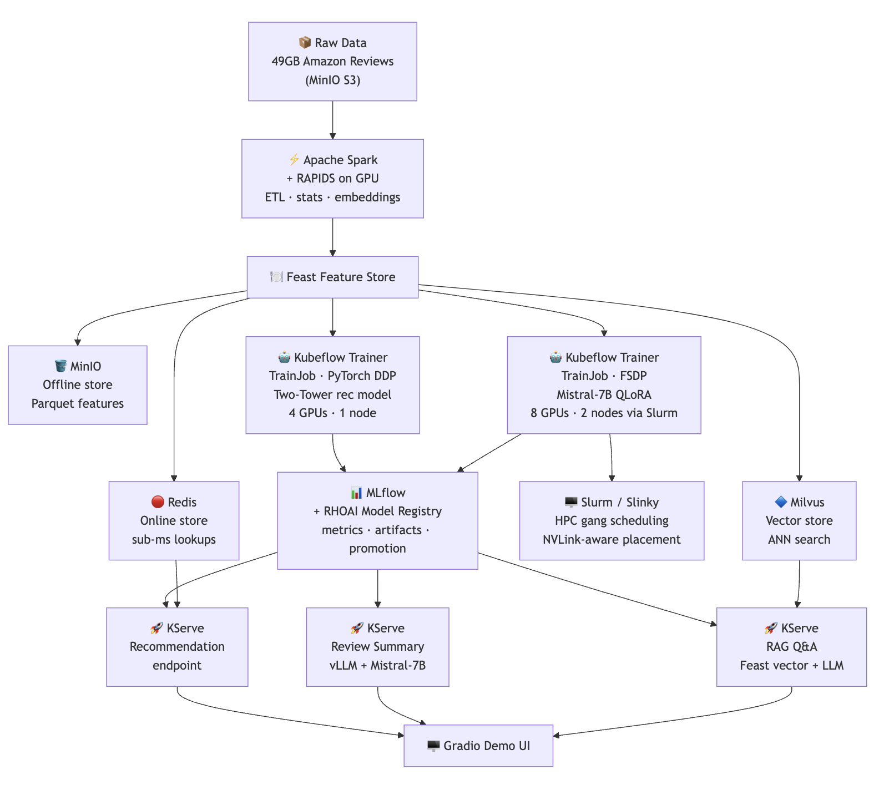

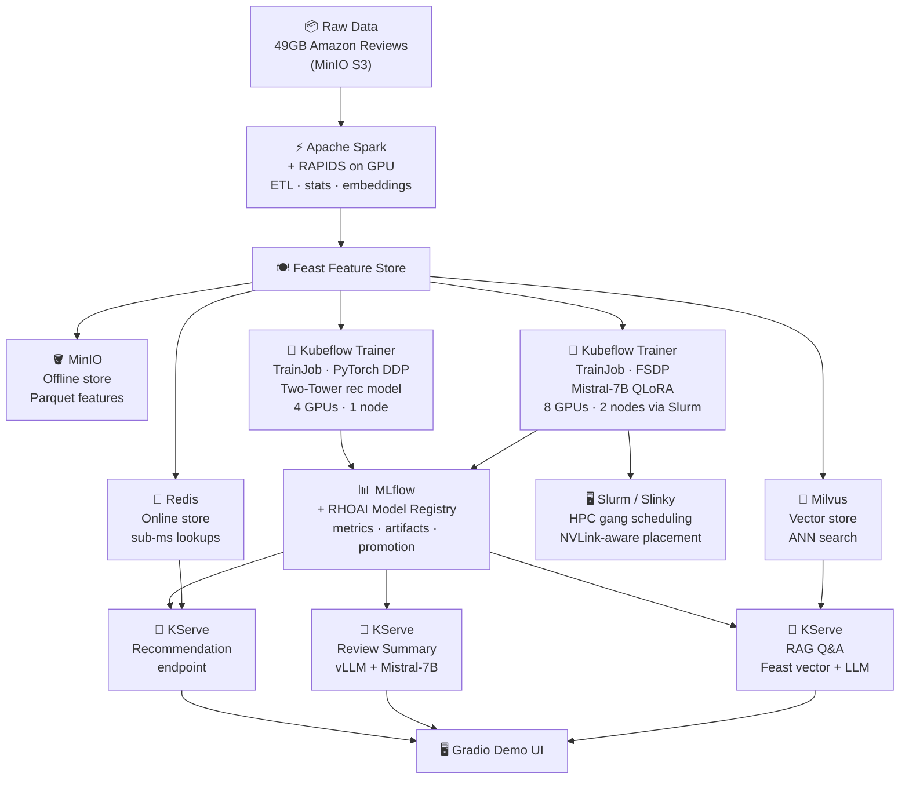
```mermaid
flowchart TD
    RAW["📦 Raw Data\n49GB Amazon Reviews\n(MinIO S3)"]

    SPARK["⚡ Apache Spark\n+ RAPIDS on GPU\nETL · stats · embeddings"]

    FEAST["🍽️ Feast Feature Store"]
    MINIO["🪣 MinIO\nOffline store\nParquet features"]
    REDIS["🔴 Redis\nOnline store\nsub-ms lookups"]
    MILVUS["🔷 Milvus\nVector store\nANN search"]

    DDP["🤖 Kubeflow Trainer\nTrainJob · PyTorch DDP\nTwo-Tower rec model\n4 GPUs · 1 node"]
    FSDP["🤖 Kubeflow Trainer\nTrainJob · FSDP\nMistral-7B QLoRA\n8 GPUs · 2 nodes via Slurm"]

    SLURM["🖥️ Slurm / Slinky\nHPC gang scheduling\nNVLink-aware placement"]

    MLFLOW["📊 MLflow\n+ RHOAI Model Registry\nmetrics · artifacts · promotion"]

    SERVE1["🚀 KServe\nRecommendation\nendpoint"]
    SERVE2["🚀 KServe\nReview Summary\nvLLM + Mistral-7B"]
    SERVE3["🚀 KServe\nRAG Q&A\nFeast vector + LLM"]

    UI["🖥️ Gradio Demo UI"]

    RAW --> SPARK
    SPARK --> FEAST
    FEAST --> MINIO
    FEAST --> REDIS
    FEAST --> MILVUS

    FEAST --> DDP
    FEAST --> FSDP
    FSDP --> SLURM

    DDP --> MLFLOW
    FSDP --> MLFLOW

    MLFLOW --> SERVE1
    MLFLOW --> SERVE2
    MLFLOW --> SERVE3

    REDIS --> SERVE1
    MILVUS --> SERVE3

    SERVE1 --> UI
    SERVE2 --> UI
    SERVE3 --> UI
```

---

## Component Reference

| Component | Stage | What it does in this demo |
|---|---|---|
| **Apache Spark** | Data processing | Processes 49GB of Amazon Reviews — computes user/product interaction stats, generates TF-IDF and sentence embeddings, outputs Parquet feature files to MinIO |
| **RAPIDS** | Data processing | Optional GPU-accelerated Spark execution — same SparkApplication YAML, 10× faster on A100s by replacing CPU executors with GPU executors |
| **MinIO** | Storage | S3-compatible object store for everything: raw data, Feast offline features (Parquet), trained model artifacts, and Milvus vector segments. Mounted as shared NFS so notebooks can inspect data directly |
| **Feast** | Feature store | Eliminates training/serving skew — the same feature definitions used to build training datasets are used at inference time. Manages three stores: offline (MinIO/Parquet), online (Redis), vector (Milvus) |
| **Redis** | Online feature store | Holds pre-materialized features in memory for sub-millisecond lookups at serving time — user embeddings, recent interactions, product stats fetched per request |
| **Milvus** | Vector store | Stores dense product/review embeddings for ANN similarity search — used during training for negative sampling and at serving time for RAG retrieval |
| **Kubeflow Trainer** | Training orchestration | Submits two `TrainJob` CRs: one for the two-tower recommendation model (PyTorch DDP, 4 GPUs), one for Mistral-7B QLoRA fine-tuning (FSDP, 8 GPUs via Slurm) |
| **Slurm (Slinky)** | HPC GPU scheduling | Handles the FSDP LLM job — gang scheduling (all GPU pods start together), NVLink-aware placement, multi-node coordination. Jobs submitted directly via `sbatch`. Workers default to `replicas=0`; scale up only for the FSDP demo segment to avoid idle GPU consumption |
| **MLflow** | Experiment tracking | Logs loss curves, hyperparameters, and model artifacts per training run. Writes artifacts to `s3://smartshop-models/` — same path referenced by Model Registry and KServe. No double-upload |
| **RHOAI Model Registry** | Model versioning | Registers model versions pointing to the existing MLflow S3 artifact path. Promotes directly to a KServe InferenceService spec — no re-upload |
| **KServe** | Model serving | Three autoscaling endpoints: recommendation (two-tower), review summary (vLLM + Mistral-7B), product Q&A (RAG — Feast vector search + LLM call) |
| **Gradio** | Demo UI | Single-page app that calls all three endpoints — shows a product page with recommendations, a generated review summary, and a live Q&A box |

---

## Shared Storage Layout

All persistent data lives on NFS PVCs (RWX). No VPC block storage is used in this demo.

### `smartshop-shared-storage` — 200Gi NFS RWX

```
smartshop-shared-storage/
│
├── minio-data/                          ← MinIO root (mounted by MinIO pod)
│   ├── smartshop-raw/                   ← 49GB Amazon Reviews JSON (input)
│   ├── smartshop-features/              ← Spark ETL output → Feast offline → training input
│   │   ├── user_features/               │  user_avg_rating, review_count, tenure…
│   │   ├── item_features/               │  item_avg_rating, price, category…
│   │   └── review_embeddings/           └  review_id, embedding[384], embed_text…
│   ├── smartshop-models/                ← single artifact store shared by all three:
│   │   ├── two-tower-rec/               │  MLflow writes → Model Registry promotes →
│   │   └── mistral-7b-qlora/            └  KServe reads storageUri (no copy, no duplication)
│   └── milvus/                          ← Milvus vector index segments + WAL (S3 backend)
```

### `slurm-home` — 50Gi NFS RWX

```
slurm-home/
└── home/shared/
    ├── scripts/
    │   ├── fsdp-train.sh                ← sbatch script: reads features from MinIO,
    │   └── test-job.sh                     writes adapter weights to smartshop-models/
    └── checkpoints/                     ← ephemeral FSDP mid-training checkpoints
                                            (deleted after training completes)
```

### Per-component NFS PVCs (RWO)

| PVC | Size | StorageClass | Used by |
|---|---|---|---|
| `redis-data` | 10Gi | `nfs-csi` | Redis AOF + RDB persistence |
| `milvus` | 50Gi | `nfs-csi` | Milvus local segment buffer (pre-S3 flush) |
| `data-milvus-etcd-0` | 10Gi | `nfs-csi` | etcd: collection metadata, schema, catalog |
| `feast-smartshop-feast-registry` | 1Gi | `nfs-csi` | Feast registry (auto-created by Feast operator) |
| `mlflow-pvc` | 20Gi | `nfs-csi` | MLflow artifact cache |

> **Why NFS for etcd?** etcd warns about `fsync` latency on NFS. For this demo,
> `ETCD_UNSAFE_NO_FSYNC=true` is set in `infrastructure/milvus/values.yaml`.
> Never set this in production.

### MLflow → Model Registry → KServe: zero-copy artifact flow

```
TrainJob (DDP or FSDP)
  └─ MLflow logs artifacts → s3://smartshop-models/<model>/<run-id>/
        │
        ▼  (registers same S3 path, no upload)
RHOAI Model Registry
  └─ promotes version → InferenceService spec
        │
        ▼  (reads storageUri at pod startup)
KServe InferenceService
  └─ storageUri: s3://smartshop-models/<model>/<run-id>/
```

---

## Prerequisites

- `oc` CLI installed and logged in as cluster admin
- `helm` v3+ installed
- `aws` CLI installed
- This repo cloned locally

---

## 1. Verify RHOAI

Go to **Operators → Installed Operators**, switch project to `redhat-ods-operator`, click **Red Hat OpenShift AI**.

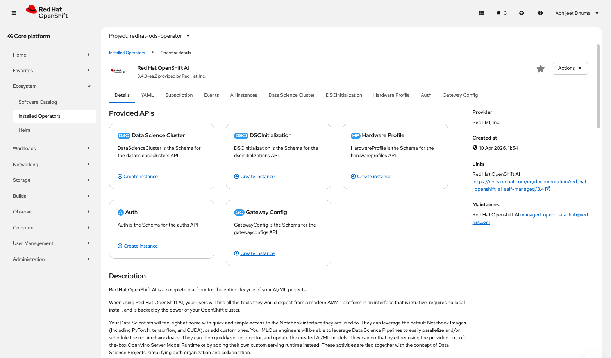

Click **Data Science Cluster** tab — confirm `default-dsc` shows **Phase: Ready**.

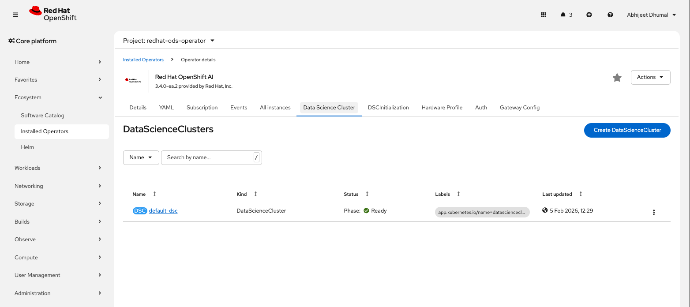

Click `default-dsc` → scroll to **Conditions** — top-level conditions must all be `True`.

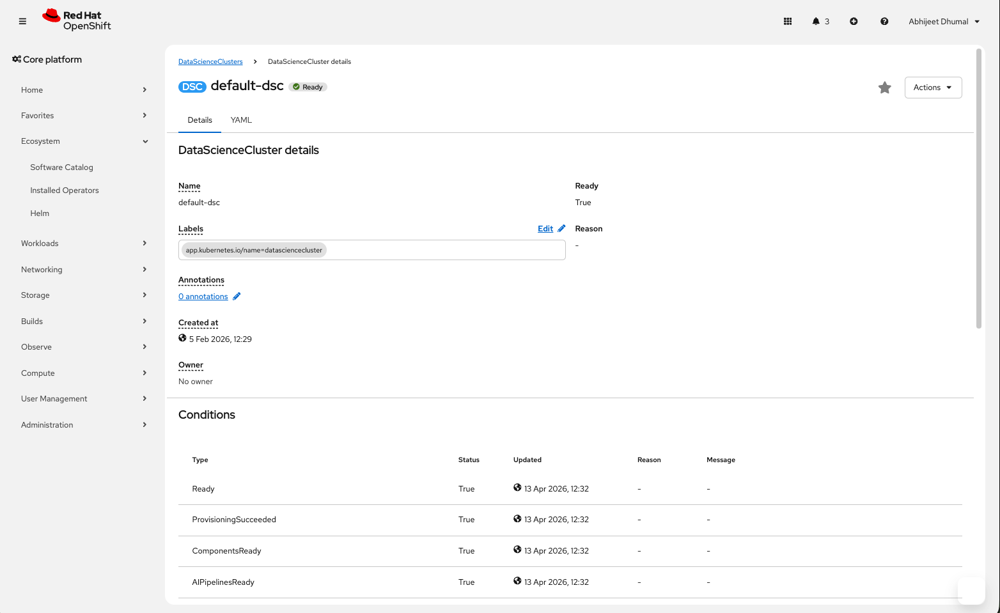

Scroll further to see per-component conditions. `FeastOperatorReady`, `KserveReady`, `MLflowOperatorReady`, `ModelRegistryReady`, and `TrainerReady` must all be `True`.

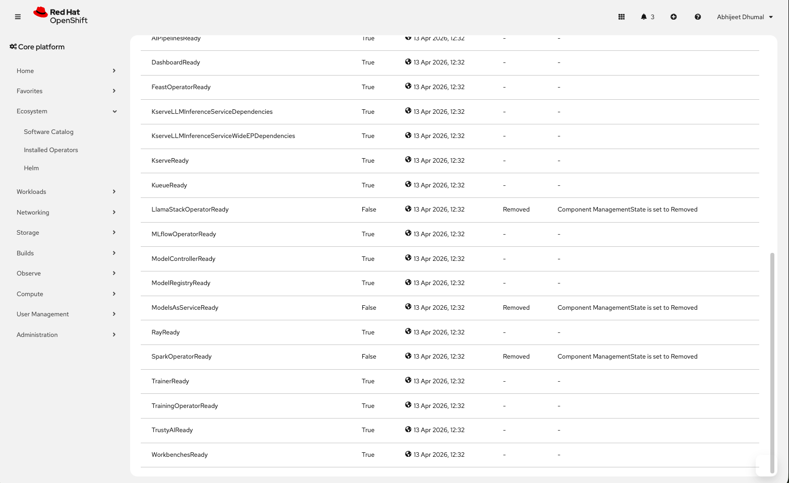

Or verify via CLI:

```bash
oc get datasciencecluster default-dsc -o jsonpath='{.status.phase}'
# Expected: Ready
```

```bash
oc get datasciencecluster default-dsc -o json \
  | jq '.status.conditions[] | select(.status == "False") | {type, reason}'
```

Any `False` condition other than `SparkOperatorReady`, `LlamaStackOperatorReady`, or `ModelsAsServiceReady` must be resolved before continuing.

---

## 2. Create Namespace

The namespace manifest includes required RHOAI labels:

```bash
oc apply -f infrastructure/smartshop/namespace.yaml
```

This creates the `smartshop` namespace with:
- `app.kubernetes.io/part-of: smartshop-ai`
- `opendatahub.io/dashboard: "true"` — makes it a Data Science Project visible in the RHOAI dashboard

---

## 3. Install Slurm Operator and Deploy Cluster

### 3a — Install the Slinky Operator (OperatorHub)

Go to **Operators → OperatorHub**, search for `slurm`. Select **Slurm Operator** (Community, Red Hat HPC Community).

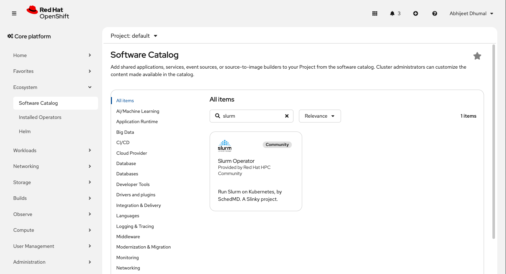

Click the tile to open the detail panel — confirm version `1.0.1-1`, channel `release-1.0`.

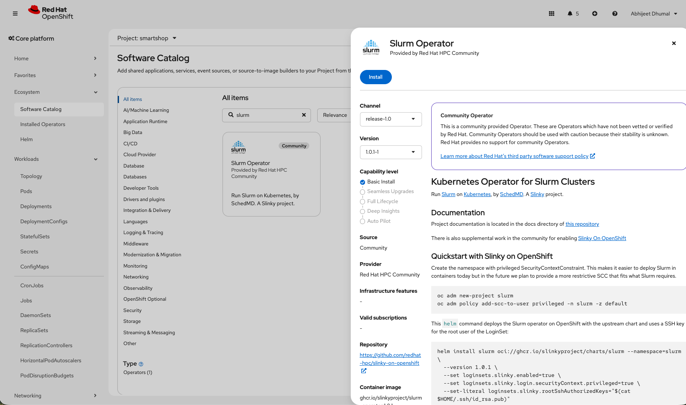

Click **Install**. Leave all defaults (installs into `slinky` namespace, cluster-wide scope). Click **Install** to confirm.

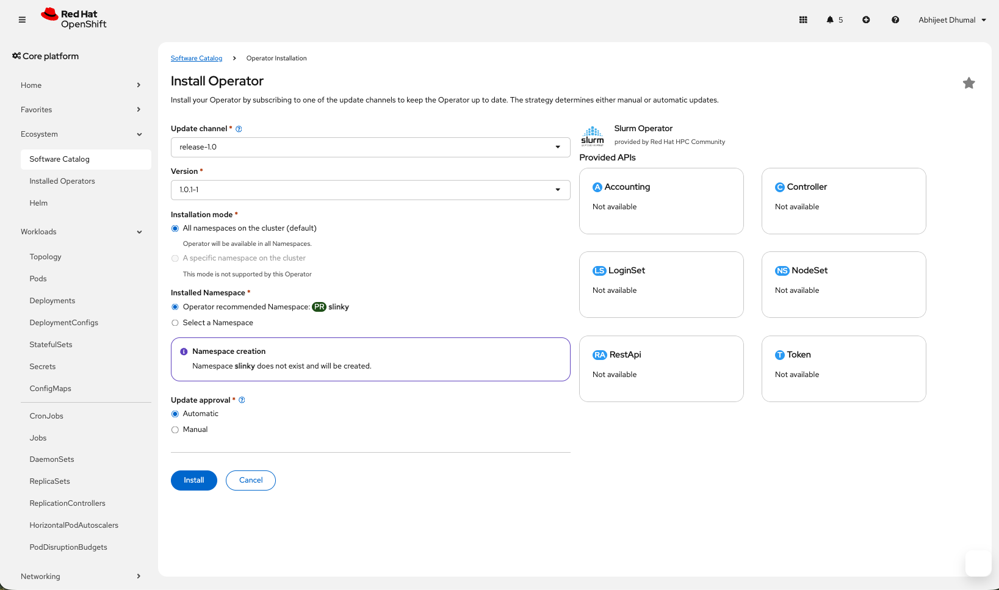

Wait ~1 min until status shows **Succeeded**.

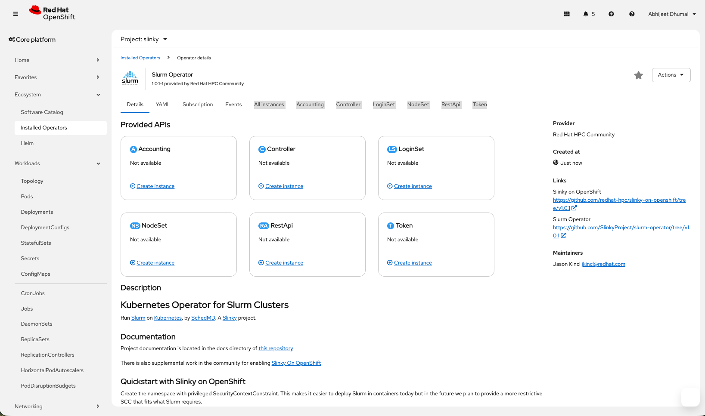

**Verify:**

```bash
oc get pods -n slinky
# slurm-operator-xxxxx         1/1   Running
# slurm-operator-webhook-xxxxx 1/1   Running
```

### 3b — Deploy the Slurm Cluster (Helm)

The operator watches for Slurm CRs. The Helm chart creates them.

```bash
# Namespace with privileged SCC (required by Slurm daemons)
oc adm new-project slurm
oc adm policy add-scc-to-user privileged -n slurm -z default

# Shared home PVC (NFS RWX — accessible from login + all worker pods)
oc apply -f infrastructure/slurm/slurm-home-pvc.yaml

# Deploy Slurm cluster
helm install slurm oci://ghcr.io/slinkyproject/charts/slurm \
  --namespace slurm \
  --version 1.0.1 \
  -f infrastructure/slurm/values.yaml \
  --set-literal "loginsets.slinky.rootSshAuthorizedKeys=$(cat ~/.ssh/id_ed25519.pub)"
```

> **Image version:** `values.yaml` pins to `25.11.1-centos9-ohpc`. Do not change this — earlier builds lack the HTTP health server the operator's liveness probe requires.

**Verify (~3 min for images to pull):**

```bash
oc get pods -n slurm
# slurm-controller-0          3/3   Running
# slurm-login-slinky-xxx      1/1   Running
# slurm-restapi-xxx           1/1   Running
# slurm-worker-slinky-0       2/2   Running
# slurm-worker-slinky-1       2/2   Running

oc exec -n slurm slurm-controller-0 -c slurmctld -- sinfo
# PARTITION  AVAIL  TIMELIMIT  NODES  STATE  NODELIST
# slinky        up   infinite      2   idle  slinky-[0-1]
# all*          up   infinite      2   idle  slinky-[0-1]
```

All four CRs (`Controller`, `NodeSet`, `LoginSet`, `RestApi`) visible in **Installed Operators → Slurm Operator → All Instances**:

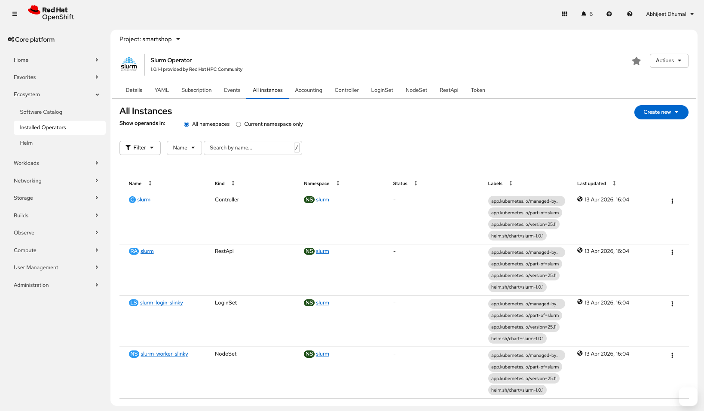

---

## 4. Enable Spark Operator

> **Do not install from OperatorHub/Software Catalog.** The catalog shows several community Spark tiles from `opdev` — avoid them:
> - **Spark Helm Operator** — uses `gcr.io/kubebuilder/kube-rbac-proxy:v0.13.1` which no longer exists; install fails with `ImagePullBackOff`
> - **Spark Application (Operator Backed)** — just a CR template, not an operator
>
> 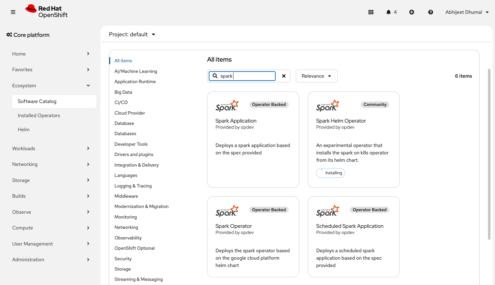
>
> Selecting the community Helm Operator shows a "Community Operator" warning badge — and it will fail immediately if you proceed:
>
> 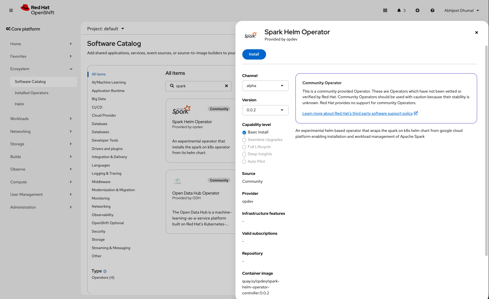
>
> 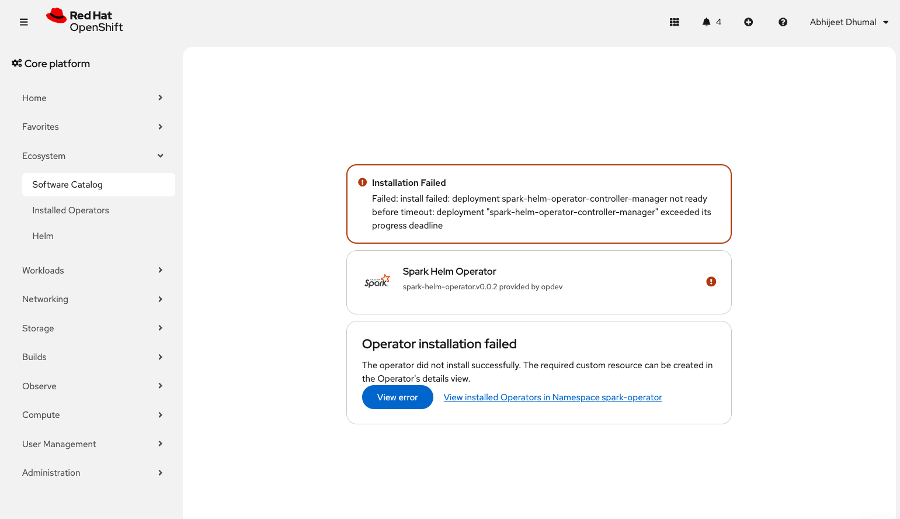
>
> RHOAI 3.4 includes a managed Spark Operator. Enable it via the DataScienceCluster — it's lifecycle-managed and integrates with the DSC health dashboard.

**Via OpenShift Web Console:**

1. Go to **Operators → Installed Operators → Red Hat OpenShift AI**
2. Click **Data Science Cluster → default-dsc → YAML**
3. Find `spec.components.spark.managementState` and set it to `Managed`
4. Click **Save**

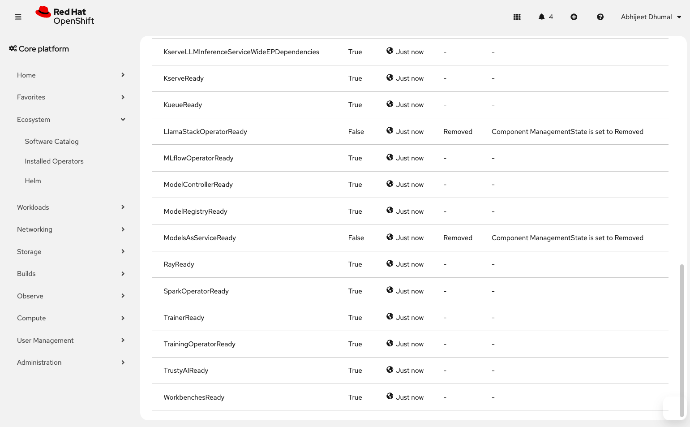

**Verify (~2 min):**

```bash
oc get datasciencecluster default-dsc \
  -o jsonpath='{.status.conditions[?(@.type=="SparkOperatorReady")].status}'
# Expected: True

oc get pods -n redhat-ods-applications | grep spark
# spark-operator-controller-xxxxx   1/1   Running
# spark-operator-webhook-xxxxx      1/1   Running
```

**Grant Spark RBAC for the `smartshop` namespace:**

```bash
oc apply -f infrastructure/smartshop/spark-rbac.yaml
```

---

## 5. Deploy MinIO

```bash
oc apply -n smartshop -f - << 'EOF'
---
apiVersion: v1
kind: ServiceAccount
metadata:
  name: demo-setup
---
apiVersion: rbac.authorization.k8s.io/v1
kind: RoleBinding
metadata:
  name: demo-setup-edit
roleRef:
  apiGroup: rbac.authorization.k8s.io
  kind: ClusterRole
  name: edit
subjects:
  - kind: ServiceAccount
    name: demo-setup
---
apiVersion: batch/v1
kind: Job
metadata:
  name: create-s3-storage
spec:
  selector: {}
  template:
    spec:
      containers:
        - args:
            - -ec
            - |-
              oc apply -f https://github.com/rh-aiservices-bu/fraud-detection/raw/main/setup/setup-s3-no-sa.yaml
          command: [/bin/bash]
          image: image-registry.openshift-image-registry.svc:5000/openshift/tools:latest
          name: create-s3-storage
      restartPolicy: Never
      serviceAccountName: demo-setup
EOF
```

Wait for jobs to complete:

```bash
oc get jobs -n smartshop -w
# create-s3-storage        1/1   Complete
# create-minio-root-user   1/1   Complete
# create-minio-buckets     1/1   Complete
```

**Switch to shared NFS storage and set simple credentials:**

```bash
# Scale down
oc scale deployment minio -n smartshop --replicas=0

# Apply the NFS PVC (infrastructure/smartshop/shared-storage.yaml)
oc apply -f infrastructure/smartshop/shared-storage.yaml

# Point MinIO at the new PVC
oc patch deployment minio -n smartshop --type=json -p='[
  {"op": "replace", "path": "/spec/template/spec/volumes/0/persistentVolumeClaim/claimName",
   "value": "smartshop-shared-storage"}
]'

# Set credentials (replace with your chosen values)
oc create secret generic minio-root-user \
  --from-literal=MINIO_ROOT_USER=<your-minio-access-key> \
  --from-literal=MINIO_ROOT_PASSWORD=<your-minio-secret-key> \
  -n smartshop --dry-run=client -o yaml | oc apply -f -

# Scale back up
oc scale deployment minio -n smartshop --replicas=1
oc rollout status deployment/minio -n smartshop

# Delete the old block PVC
oc delete pvc minio -n smartshop
```

**Create SmartShop buckets:**

```bash
export S3=https://$(oc get route minio-s3 -n smartshop -o jsonpath='{.spec.host}')

for bucket in smartshop-raw smartshop-features smartshop-models smartshop-embeddings milvus; do
  AWS_ACCESS_KEY_ID=<your-minio-access-key> AWS_SECRET_ACCESS_KEY=<your-minio-secret-key> \
    aws s3 mb s3://$bucket --endpoint-url $S3 --no-verify-ssl
done
```

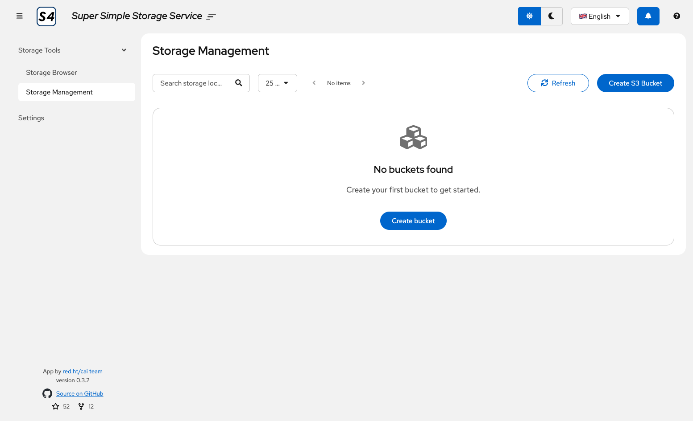

**Create shared credentials secret:**

```bash
# infrastructure/smartshop/credentials.yaml — consolidated secret for all components.
# Update MINIO_ENDPOINT_EXTERNAL with your cluster domain first.
oc apply -f infrastructure/smartshop/credentials.yaml
```

> **MinIO note:** Open-source MinIO is used here for simplicity. For production use
> **ODF (OpenShift Data Foundation)** or **AIStor** (MinIO's enterprise successor).
> AIStor is available in OperatorHub — search for `minio` in the Software Catalog.
>
> 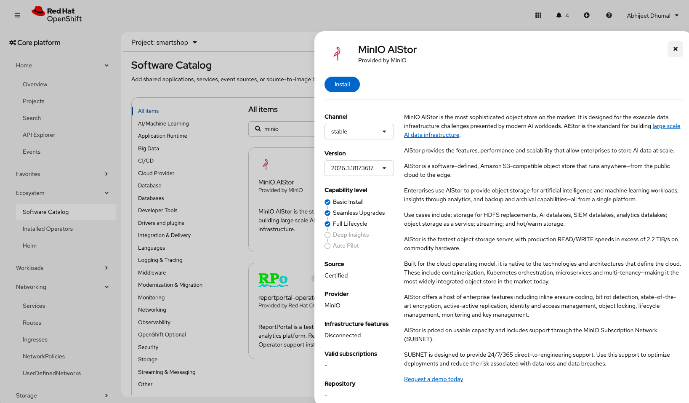

---

## 6. Deploy Redis + RedisInsight UI

```bash
oc apply -f infrastructure/redis/redis.yaml
oc rollout status deployment/redis deployment/redisinsight -n smartshop
```

This creates:
- `redis-data` PVC — 10Gi, `nfs-csi`, `ReadWriteMany` (RWO would also work — only one Redis pod mounts it)
- `redis-credentials` Secret — password from `infrastructure/redis/redis.yaml`
- Route for RedisInsight UI

**Verify:**

```bash
oc exec -it deployment/redis -n smartshop -- \
  redis-cli -a <your-redis-password> ping
# PONG
```

---

## 7. Deploy Milvus + Attu UI

The deploy script handles two known OpenShift issues automatically:

**Issue 1 — etcd SCC:** `milvusdb/etcd` runs as UID 1001, outside OpenShift's default allowed range. The script creates a `milvus` ServiceAccount and grants it `anyuid` SCC.

**Issue 2 — env var injection:** Kubernetes auto-injects `MINIO_PORT`, `MINIO_SERVICE_HOST` etc. from the `minio` Service in the same namespace. These override `values.yaml` and cause Milvus to build a malformed S3 URL (`Endpoint url cannot have fully qualified paths`). The script blanks these injected vars explicitly. ([upstream issue](https://github.com/zilliztech/milvus-helm/issues/99))

```bash
cd infrastructure/milvus && ./deploy.sh smartshop
oc apply -f infrastructure/milvus/attu.yaml
oc rollout status deployment/attu -n smartshop
```

**Verify:**

```bash
oc get pods -n smartshop | grep milvus
# milvus-etcd-0                  1/1   Running
# milvus-standalone-xxxxx        1/1   Running

oc logs -n smartshop deployment/milvus-standalone | grep "ready to serve"
# ---Milvus Proxy successfully initialized and ready to serve!---
```

After MinIO, Redis, and Milvus are up, all four core pods should be running in `smartshop`:

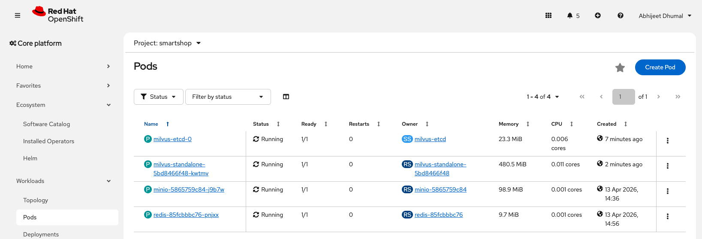

---

## 8. Deploy Feast Feature Store

Feast is installed and managed by the RHOAI Feast Operator (enabled by default in the DSC as `FeastOperatorReady`).

### 8a — Apply Secrets and FeatureStore CR

`infrastructure/feast/feast-operator.yaml` contains everything in one file: the `feast-s3-credentials` Secret (MinIO access), the `feast-redis-secret` Secret (Redis password), and the `FeatureStore` CR itself.

```bash
oc apply -f infrastructure/feast/feast-operator.yaml
```

The CR configures:
- **Offline store** — `dask` type, reads Parquet from MinIO S3 in-memory (no dedicated PVC)
- **Online store** — Redis with password auth via `feast-redis-secret`
- **Registry** — dedicated 1Gi `nfs-csi` PVC auto-created at `/feast-registry`
- **Feature source** — cloned from `https://github.com/abhijeet-dhumal/prod-ml-demo.git`, branch `refine-cluster-infra-setup`, path `feast/feature_repo` (update `ref:` in `feast-operator.yaml` when merging to `main`)

> **NFS double-mount gotcha:** The Feast pod runs registry, offline, and online store servers
> in the same pod. NFS CSI cannot mount the same PV twice within a single pod.
> This is why the registry gets its own dedicated 1Gi PVC instead of reusing
> `smartshop-shared-storage`. The offline store uses no PVC — Dask reads from S3 directly.

**Watch rollout (~2 min):**

```bash
oc get pods -n smartshop -l app=feast-smartshop-feast -w
# feast-smartshop-feast-xxxxxxxxx-xxxxx   0/4   Init:0/1   → 4/4   Running
```

**Verify:**

```bash
oc get featurestore -n smartshop
# NAME              STATUS   AGE
# smartshop-feast   Ready    Xm

oc get featurestore smartshop-feast -n smartshop -o jsonpath='{.status.phase}'
# Ready
```

### 8b — Enable Feature Store in RHOAI Dashboard

The Feature Store tab in the RHOAI dashboard is gated behind a feature flag that defaults to **disabled**. Patch it once per cluster:

```bash
oc patch odhdashboardconfig odh-dashboard-config \
  -n redhat-ods-applications \
  --type=merge \
  -p '{"spec":{"dashboardConfig":{"disableFeatureStore":false}}}'

# Restart dashboard to pick up the config change
oc rollout restart deployment/rhods-dashboard -n redhat-ods-applications
oc rollout status deployment/rhods-dashboard -n redhat-ods-applications
```

The FeatureStore CR also needs the label `feature-store-ui: enabled` — this is already present in `infrastructure/feast/feast-operator.yaml`. Verify:

```bash
oc get featurestore smartshop-feast -n smartshop \
  -o jsonpath='{.metadata.labels.feature-store-ui}'
# enabled
```

After the dashboard restarts, the **Feature Store** section appears in the RHOAI sidebar under the `smartshop` project.

---

## 9. Deploy MLflow (PostgreSQL backend)

MLflow is operator-managed in `redhat-ods-applications`. It requires a PostgreSQL database for its backend store.

### 9a — Deploy PostgreSQL in `smartshop`

```bash
oc apply -f infrastructure/mlflow/postgres.yaml
oc rollout status deployment/postgres -n smartshop
```

The manifest at `infrastructure/mlflow/postgres.yaml` creates:
- `postgres` Deployment — `postgres:15` image, 1Gi NFS PVC (`postgres-data`)
- `postgres` Service on port 5432
- `postgres-credentials` Secret with `POSTGRES_USER=feast`, `POSTGRES_PASSWORD=feast`, `POSTGRES_DB=mlflow`

### 9b — Update MLflow Backend Secret

Point MLflow's backend store at the new PostgreSQL instance.

> **OVN-K DNS gotcha:** MLflow's `NetworkPolicy` in `redhat-ods-applications` has
> `policyTypes: [Ingress, Egress]` (operator-managed). DNS lookups for cross-namespace
> CNAME chains fail under OVN-K even though port 53 is listed in the egress rules.
> Use the postgres Service **ClusterIP** directly — TCP connectivity works fine.

```bash
POSTGRES_IP=$(oc get svc postgres -n smartshop -o jsonpath='{.spec.clusterIP}')
# Use the same user/password set in infrastructure/mlflow/postgres.yaml
PG_USER=<your-pg-user>
PG_PASS=<your-pg-password>

oc create secret generic mlflow-postgres-secret \
  --from-literal=uri="postgresql+psycopg2://${PG_USER}:${PG_PASS}@${POSTGRES_IP}:5432/mlflow?sslmode=disable" \
  -n redhat-ods-applications \
  --dry-run=client -o yaml | oc apply -f -
```

### 9c — Create S3 Credentials and Patch MLflow CR

MLflow writes artifacts to MinIO — the S3 credentials must be in `redhat-ods-applications`:

```bash
oc create secret generic mlflow-s3-credentials \
  --from-literal=AWS_ACCESS_KEY_ID=<your-minio-access-key> \
  --from-literal=AWS_SECRET_ACCESS_KEY=<your-minio-secret-key> \
  --from-literal=MLFLOW_S3_ENDPOINT_URL=http://minio.smartshop.svc.cluster.local:9000 \
  --from-literal=AWS_DEFAULT_REGION=us-east-1 \
  -n redhat-ods-applications --dry-run=client -o yaml | oc apply -f -
```

Patch the MLflow CR to use S3 as artifact destination (see `infrastructure/mlflow/mlflow-cr.yaml`):

```bash
oc patch mlflow mlflow -n redhat-ods-applications --type=merge -p '{
  "spec": {
    "artifactsDestination": "s3://smartshop-models",
    "serveArtifacts": true,
    "envFrom": [{"secretRef": {"name": "mlflow-s3-credentials"}}]
  }
}'
```

### 9d — Verify MLflow is Running

```bash
oc rollout restart deployment/mlflow -n redhat-ods-applications
oc rollout status deployment/mlflow -n redhat-ods-applications

oc get pods -n redhat-ods-applications | grep mlflow
# mlflow-xxxxx   2/2   Running
```

> **Fixed:** MLflow was crash-looping because the backend secret pointed to
> `postgres.feast-trainer-demo.svc.cluster.local` — an old namespace that no longer exists.
> Steps 9a–9d above resolve this.

**MLflow UI:**

```bash
oc get route mlflow -n redhat-ods-applications -o jsonpath='{.spec.host}'
```


---

## 10. Run Spark ETL (Feature Engineering)

> **Prerequisite:** Build and push `quay.io/smartshop/spark-jobs:latest` before this step.
> The SparkApplication manifest uses a custom image containing the feature engineering script.
> *(Custom image build is a pending task — placeholder step.)*

```bash
oc apply -f infrastructure/openshift/spark-application.yaml
```

Or for the GPU-accelerated path (requires RAPIDS-capable GPU nodes):

```bash
oc apply -f infrastructure/openshift/spark-application-rapids.yaml
```

**Monitor:**

```bash
oc get sparkapplication smartshop-feature-engineering -n smartshop
# NAME                             STATUS      ATTEMPTS   START                  FINISH
# smartshop-feature-engineering   COMPLETED   1          2026-xx-xx             2026-xx-xx

# Driver logs
oc logs -n smartshop \
  $(oc get pod -n smartshop -l spark-role=driver -o name) --follow
```

When the job completes, the following MinIO buckets will be populated with Parquet files:
- `s3://smartshop-features/user_features/`
- `s3://smartshop-features/item_features/`
- `s3://smartshop-embeddings/review_embeddings/`

### Materialize features into Redis (online store)

After ETL completes, push features from the offline store (MinIO) into the online store (Redis):

```bash
# Run inside a pod that has feast installed, or use the feast server pod
oc exec -it deployment/feast-smartshop-feast -n smartshop -c feast-offline-server -- \
  feast -c /feast-registry materialize-incremental $(date -u +%Y-%m-%dT%H:%M:%S)
```

---

## 11. Run PyTorch Training Jobs

> **Prerequisite:** Build and push trainer images before submitting jobs:
> - `quay.io/smartshop/rec-trainer:latest` — two-tower recommendation model
> - `quay.io/smartshop/llm-trainer:latest` — Mistral-7B QLoRA fine-tuning
>
> *(Custom image builds are pending tasks — placeholder steps.)*

### 11a — Recommendation Model (DDP, 4 GPUs, 1 node)

```bash
# Create HuggingFace credentials secret (required by LLM trainer; optional for rec trainer)
oc create secret generic hf-credentials \
  --from-literal=token=<YOUR_HF_TOKEN> \
  -n smartshop --dry-run=client -o yaml | oc apply -f -

# Apply TrainingRuntime and TrainJob
oc apply -f infrastructure/openshift/trainjobs.yaml

# Watch the DDP job
oc get trainjob smartshop-rec-train -n smartshop -w
```

### 11b — LLM Fine-tuning (FSDP, 8 GPUs, 2 nodes via Slurm)

The FSDP job dispatches to Slurm for NVLink-aware gang scheduling. Before submitting, scale the Slurm workers up from 0:

```bash
# Scale workers up (default is 0 to avoid idle GPU cost)
oc patch nodesets.slinky.slurm.net slinky -n slurm \
  --type=merge -p '{"spec":{"replicas":2}}'

# Wait for nodes to show as idle in Slurm
oc exec -n slurm slurm-controller-0 -c slurmctld -- sinfo
# PARTITION  AVAIL  TIMELIMIT  NODES  STATE  NODELIST
# slinky        up   infinite      2   idle  slinky-[0-1]

# Apply the FSDP TrainJob (reuses the same trainjobs.yaml)
oc apply -f infrastructure/openshift/trainjobs.yaml

# Watch
oc get trainjob smartshop-llm-finetune -n smartshop -w
```

After training, scale workers back down:

```bash
oc patch nodesets.slinky.slurm.net slinky -n slurm \
  --type=merge -p '{"spec":{"replicas":0}}'
```

---

## 12. Deploy Inference Services

> **Prerequisite:** Trained models must be available at `s3://smartshop-models/` and
> custom serving images must be built:
> - `quay.io/smartshop/rec-server:latest` — recommendation endpoint
>
> *(Serving image builds are pending tasks — placeholder step.)*

```bash
oc apply -f infrastructure/openshift/inferenceservices.yaml
oc get inferenceservice -n smartshop -w
# NAME            URL                                                   READY
# smartshop-rec   https://smartshop-rec-smartshop.apps.<cluster>/      True
```

---

## Quick Reference

| Component | Endpoint | Credentials |
|---|---|---|
| MinIO Console | `https://minio-console-smartshop.apps.<cluster>/` | Secret: `minio-root-user` |
| MinIO S3 (internal) | `http://minio.smartshop.svc.cluster.local:9000` | Secret: `smartshop-credentials` |
| MinIO S3 (external) | `https://minio-s3-smartshop.apps.<cluster>/` | Secret: `smartshop-credentials` |
| Redis | `redis.smartshop.svc.cluster.local:6379` | Secret: `redis-credentials` |
| RedisInsight UI | `https://redisinsight-smartshop.apps.<cluster>/` | Add database on first open |
| Milvus gRPC | `milvus.smartshop.svc.cluster.local:19530` | — |
| Milvus REST | `milvus.smartshop.svc.cluster.local:9091` | — |
| Attu (Milvus UI) | `https://attu-smartshop.apps.<cluster>/` | Pre-configured to `milvus:19530` |
| Feast Offline server | `feast-smartshop-feast-offline.smartshop.svc.cluster.local:8815` | — |
| Feast Online server | `feast-smartshop-feast-online.smartshop.svc.cluster.local:6566` | — |
| Feast Registry (REST) | `feast-smartshop-feast-registry.smartshop.svc.cluster.local:6570` | — |
| Feast UI | `https://feast-smartshop-feast-ui-smartshop.apps.<cluster>/` | — |
| MLflow UI | `https://mlflow-redhat-ods-applications.apps.<cluster>/` | — |
| Slurm login (SSH) | `ssh -o ProxyCommand='oc exec -i -n slurm svc/%h -- socat STDIO TCP:localhost:22' root@slurm-login-slinky` | SSH key at `~/.ssh/id_ed25519` |
| Slurm REST API | `http://slurm-restapi.slurm.svc.cluster.local:6820` | JWT token via `scontrol token` |

| Component | PVC | Size | StorageClass |
|---|---|---|---|
| MinIO data | `smartshop-shared-storage` | 200Gi | `nfs-csi` (RWX) |
| Redis AOF | `redis-data` | 10Gi | `nfs-csi` (RWX) |
| Milvus standalone | `milvus` | 50Gi | `nfs-csi` (RWO) |
| Milvus etcd | `data-milvus-etcd-0` | 10Gi | `nfs-csi` (RWO) |
| Feast registry | `feast-smartshop-feast-registry` | 1Gi | `nfs-csi` (RWO) |
| MLflow artifacts | `mlflow-pvc` | 20Gi | `nfs-csi` (RWX) |
| PostgreSQL (MLflow backend) | `postgres-data` | 5Gi | `nfs-csi` (RWO) |
| Slurm home | `slurm-home` | 50Gi | `nfs-csi` (RWX) |
| Slurm statesave | `statesave-slurm-controller-0` | 1Gi | `nfs-csi` (RWO) |

| Bucket | Purpose |
|---|---|
| `smartshop-raw` | Raw Amazon Reviews dataset |
| `smartshop-features` | Feast offline feature store (Parquet) |
| `smartshop-models` | Trained model artifacts |
| `smartshop-embeddings` | Product/user embedding vectors |
| `milvus` | Milvus vector index segments |

---

## Pending / Outstanding Work

| Item | Status | Notes |
|---|---|---|
| MLflow PostgreSQL | **Broken** | Deploy `infrastructure/mlflow/postgres.yaml` (needs to be created), update `mlflow-postgres-secret` to point to `postgres.smartshop.svc.cluster.local` |
| Spark ETL job | **Placeholder** | Needs `quay.io/smartshop/spark-jobs:latest` image |
| Recommendation model training | **Placeholder** | Needs `quay.io/smartshop/rec-trainer:latest` image |
| LLM fine-tuning | **Placeholder** | Needs `quay.io/smartshop/llm-trainer:latest` image + HF token |
| InferenceService | **Placeholder** | Needs trained model + `quay.io/smartshop/rec-server:latest` image |
| Gradio demo UI | **Not started** | — |
