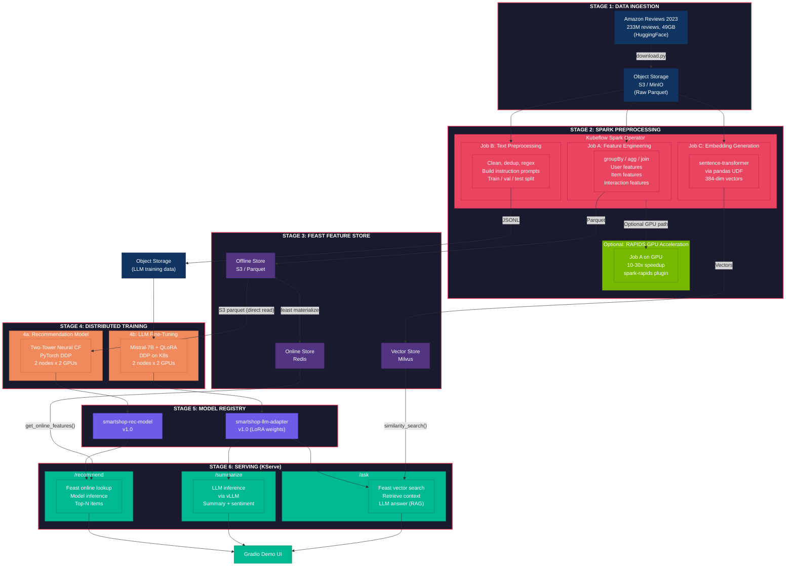
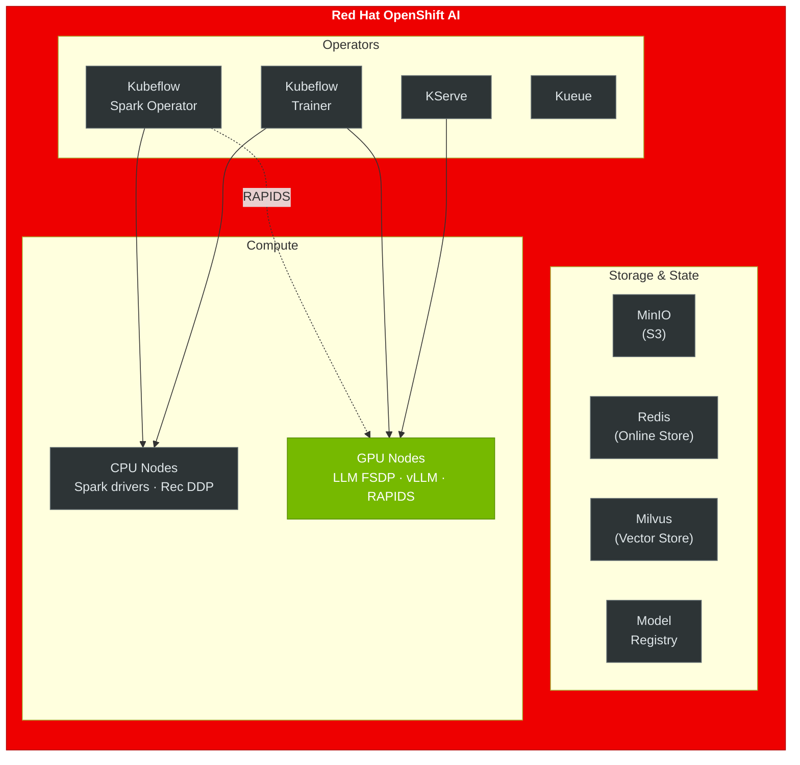

# SmartShop AI — Architecture

## Overview

SmartShop AI demonstrates production ML at scale on Red Hat OpenShift AI: distributed
feature engineering with Spark, feature serving with Feast, distributed training with
Kubeflow Trainer (DDP + QLoRA/FSDP on K8s), and multi-model serving with KServe.

- **Recommends products** — Two-Tower neural CF model trained on 29.6 GB of reviews
- **Summarizes reviews** — Mistral-7B fine-tuned with QLoRA via FSDP
- **Answers product questions** — RAG over 384-dim review embeddings in Milvus

---

## Pipeline Diagram

---

## Infrastructure Diagram

---

## Data Flow Summary

| Stage | Input | Processing | Output | Accelerator |
|---|---|---|---|---|
| 1. Ingest | HuggingFace dataset | `download.py` | S3 raw Parquet | — |
| 2a. Features | Raw reviews | Spark groupBy/agg/join | Feast offline store (Parquet) | CPU or GPU (RAPIDS) |
| 2b. Text prep | Raw reviews | Spark filter/dedup + UDFs | JSONL on S3 | CPU |
| 2c. Embeddings | Raw reviews | sentence-transformer UDF | Feast vector store (Milvus) | CPU (UDF) |
| 3. Feast | Offline Parquet | `feast materialize` | Redis online store | — |
| 4a. Rec model | S3 interactions | PyTorch DDP (2 nodes x 2 GPUs) | Model Registry | GPU |
| 4b. LLM | JSONL training data | QLoRA DDP (2 nodes x 2 GPUs) | Model Registry | GPU |
| 6. Serving | User requests | KServe + vLLM | JSON responses | GPU |

---

## Why Each Component

| Component | Role | Why It's Needed |
|---|---|---|
| **Spark** | ETL, feature eng, embeddings | 29.6 GB of reviews can't be processed in pandas |
| **RAPIDS** | GPU-accelerated Spark | 4% speedup on feature engineering — same PySpark code, zero changes; see `feast/BFV-DESIGN.md §5` |
| **Feast** | Feature store + vector store | Train-serve skew prevention; vector store for RAG |
| **Kubeflow Trainer** | Distributed training orchestration | DDP rec model + QLoRA LLM fine-tuning via TrainJob CRD |
| **KServe** | Model serving | Three autoscaling endpoints |
| **Milvus** | Vector similarity search | RAG retrieval over 5M review embeddings |

---

## Key References

- [Feast GenAI Integration](https://docs.feast.dev/getting-started/genai)
- [Sovereign AI with Kubeflow Trainer + Feast](https://redhat.com/en/blog/sovereign-ai-architecture-scaling-distributed-training-kubeflow-trainer-and-feast-red-hat-openshift-ai)
- [Fine-tune RAG with Feast + Kubeflow Trainer](https://developers.redhat.com/articles/2025/12/17/fine-tune-rag-model-feast-kubeflow-trainer)
- [Red Hat AI Quickstart Product Recommender](https://developers.redhat.com/articles/2026/01/20/ai-quickstart-product-recommender-openshift-ai)
- [Amazon Reviews 2023 Dataset](https://huggingface.co/datasets/McAuley-Lab/Amazon-Reviews-2023)
