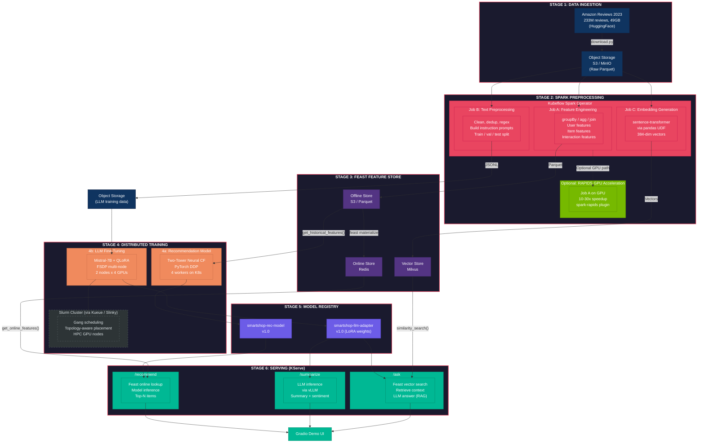
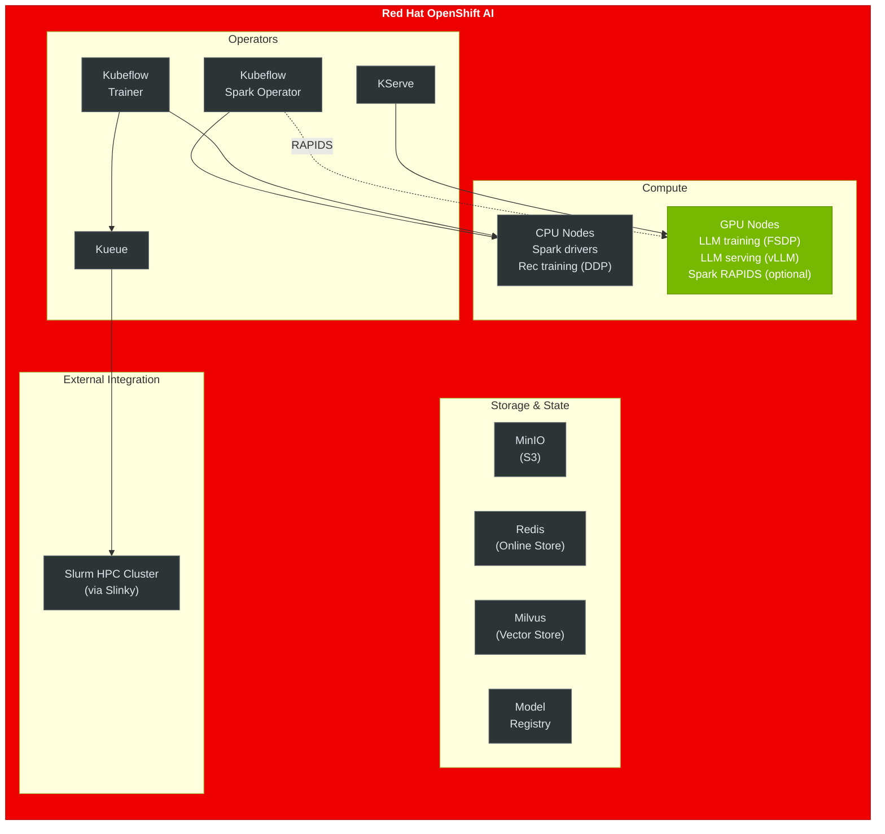

# SmartShop AI -- Architecture Diagram

## Infrastructure & Orchestration

## Data Flow Summary

| Stage | Input | Processing | Output | Accelerator |
|---|---|---|---|---|
| 1. Ingest | HuggingFace dataset | `download.py` | S3 raw Parquet | -- |
| 2a. Features | Raw reviews + metadata | Spark groupBy/agg/join | Feast offline store | CPU or GPU (RAPIDS) |
| 2b. Text prep | Raw reviews | Spark filter/dedup + UDFs | JSONL on S3 | CPU |
| 2c. Embeddings | Raw reviews | sentence-transformer UDF | Feast vector store | GPU (model) |
| 3. Feast | Offline Parquet | `feast materialize` | Redis online store | -- |
| 4a. Rec model | Feast features | PyTorch DDP (4 workers) | Model Registry | GPU |
| 4b. LLM | JSONL training data | FSDP QLoRA (8 GPUs) | Model Registry | GPU |
| 6. Serving | User requests | KServe + vLLM | JSON responses | GPU |
