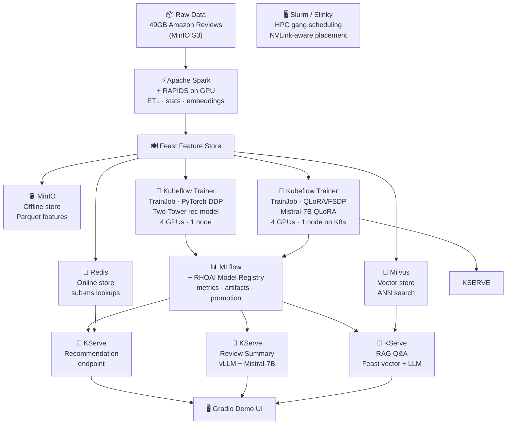

# SmartShop AI — Setup Guide

**Platform:** Red Hat OpenShift AI (RHOAI) 3.4+  
**Cluster:** `${OC_CLUSTER_DOMAIN}` · **Namespace:** `smartshop`

> This is the complete operator reference for deploying the SmartShop AI demo from scratch.
> If you are presenting the demo (not deploying it), see [Demo Script](../demo/SCRIPT.md) instead.

---

## What This Demo Does

SmartShop AI is a production e-commerce ML platform with three end-user features, all served live from a single Gradio UI:

1. **Product recommendations** — two-tower PyTorch model trained on 140M purchase interactions; features fetched from Redis in < 1 ms
2. **Review summaries** — Mistral-7B fine-tuned with QLoRA on 104M cleaned reviews; served via vLLM on KServe
3. **Product Q&A** — RAG pipeline that retrieves semantically similar reviews from Milvus and answers via the same LLM endpoint

The full pipeline — from raw S3 data to live endpoints — runs entirely on OpenShift AI using managed operators and standard Kubernetes manifests. There are no custom scripts that bypass the platform.

---

## Pipeline Overview



---

## Component Reference

| Component | Stage | What it does in this demo |
|---|---|---|
| **Apache Spark** | Data processing | Processes 49GB of Amazon Reviews — computes user/product interaction stats, generates TF-IDF and sentence embeddings, outputs Parquet feature files to MinIO |
| **RAPIDS** | Data processing | Optional GPU-accelerated Spark execution — same SparkApplication YAML, 10× faster on A100s by replacing CPU executors with GPU executors |
| **MinIO** | Storage | S3-compatible object store for everything: raw data, Feast offline features (Parquet), trained model artifacts, and Milvus vector segments. Mounted as shared NFS so notebooks can inspect data directly |
| **Feast** | Feature store | Eliminates training/serving skew — the same feature definitions used to build training datasets are used at inference time. Manages three stores: offline (MinIO/Parquet), online (Redis), vector (Milvus) |
| **Redis** | Online feature store | Holds pre-materialized features in memory for sub-millisecond lookups at serving time — user embeddings, recent interactions, product stats fetched per request |
| **Milvus** | Vector store | Stores dense product/review embeddings for ANN similarity search — used during training for negative sampling and at serving time for RAG retrieval |
| **Kubeflow Trainer** | Training orchestration | Submits two `TrainJob` CRs: one for the two-tower recommendation model (PyTorch DDP, 4 GPUs), one for Mistral-7B QLoRA fine-tuning (FSDP, 4 GPUs on K8s) |
| **MLflow** | Experiment tracking | Logs loss curves, hyperparameters, and model artifacts per training run. Writes artifacts to `s3://smartshop-models/` — same path referenced by Model Registry and KServe. No double-upload |
| **RHOAI Model Registry** | Model versioning | Registers model versions pointing to the existing MLflow S3 artifact path. Promotes directly to a KServe InferenceService spec — no re-upload |
| **KServe** | Model serving | Three autoscaling endpoints: recommendation (two-tower), review summary (vLLM + Mistral-7B), product Q&A (RAG — Feast vector search + LLM call) |
| **Gradio** | Demo UI | Single-page app that calls all three endpoints — shows a product page with recommendations, a generated review summary, and a live Q&A box |

---

## Shared Storage Layout

All persistent data lives on NFS PVCs (RWX). No VPC block storage is used in this demo.

### `smartshop-shared-storage` — 200Gi NFS RWX

```
smartshop-shared-storage/
│
├── minio-data/                          ← MinIO root (mounted by MinIO pod)
│   ├── smartshop-raw/                   ← 49GB Amazon Reviews JSON (input)
│   ├── smartshop-features/              ← Spark ETL output → Feast offline → training input
│   │   ├── user_features/               │  user_avg_rating, review_count, tenure…
│   │   ├── item_features/               │  item_avg_rating, price, category…
│   │   └── review_embeddings/           └  review_id, embedding[384], embed_text…
│   ├── smartshop-models/                ← single artifact store shared by all three:
│   │   ├── two-tower-rec/               │  MLflow writes → Model Registry promotes →
│   │   └── mistral-7b-qlora/            └  KServe reads storageUri (no copy, no duplication)
│   └── milvus/                          ← Milvus vector index segments + WAL (S3 backend)
```

### `slurm-home` — 50Gi NFS RWX

```
slurm-home/
└── home/shared/
    ├── scripts/
    │   ├── fsdp-train.sh                ← sbatch script: reads features from MinIO,
    │   └── test-job.sh                     writes adapter weights to smartshop-models/
    └── checkpoints/                     ← ephemeral FSDP mid-training checkpoints
                                            (deleted after training completes)
```

### Per-component NFS PVCs (RWO)

| PVC | Size | StorageClass | Used by |
|---|---|---|---|
| `redis-data` | 10Gi | `nfs-csi` | Redis AOF + RDB persistence |
| `milvus` | 50Gi | `nfs-csi` | Milvus local segment buffer (pre-S3 flush) |
| `data-milvus-etcd-0` | 10Gi | `nfs-csi` | etcd: collection metadata, schema, catalog |
| `feast-smartshop-feast-registry` | 1Gi | `nfs-csi` | Feast registry (auto-created by Feast operator) |
| `mlflow-pvc` | 20Gi | `nfs-csi` | MLflow artifact cache |

> **Why NFS for etcd?** etcd warns about `fsync` latency on NFS. For this demo,
> `ETCD_UNSAFE_NO_FSYNC=true` is set in `infrastructure/milvus/values.yaml`.
> Never set this in production.

### MLflow → Model Registry → KServe: zero-copy artifact flow

```
TrainJob (DDP or FSDP)
  └─ MLflow logs artifacts → s3://smartshop-models/<model>/<run-id>/
        │
        ▼  (registers same S3 path, no upload)
RHOAI Model Registry
  └─ promotes version → InferenceService spec
        │
        ▼  (reads storageUri at pod startup)
KServe InferenceService
  └─ storageUri: s3://smartshop-models/<model>/<run-id>/
```

---

## Prerequisites

### Cluster

| Requirement | Minimum | Notes |
|---|---|---|
| Red Hat OpenShift AI | 3.4+ | RHOAI operator must be installed via OperatorHub |
| Spark Operator | RHOAI-managed | Enable via `DataScienceCluster` → `spec.components.spark.managementState: Managed` |
| Kubeflow Trainer v2 | v2.x | `TrainJob` CRD required |
| Slurm / Slinky | Slinky Operator 0.9+ | Optional — Slurm integration deferred pending upstream Kubeflow Trainer support |
| Feast Operator | RHOAI-managed | Enabled via RHOAI dashboard or DSC |
| KServe | RHOAI-managed | Serverless mode |
| GPU nodes | 1 node × 4 GPUs minimum | NVIDIA A100 recommended; RAPIDS requires GPU executor nodes |
| NFS RWX StorageClass | `nfs-csi` or equivalent | 200Gi shared storage required for MinIO |
| GPU Operator + DCGM | Latest from OperatorHub | Required for Prometheus GPU metrics |

### Local tools

```bash
oc      # OpenShift CLI — oc login before running any make target
helm    # v3+ for Milvus and Slurm helm installs
aws     # AWS CLI configured to point at MinIO (used for bucket operations)
make    # GNU make
jq      # used by apply-all.sh for DSC condition checks
python3 # with pyarrow (pip install pyarrow) for the Feast schema step
```

### Clone the repo

```bash
git clone https://github.com/abhijeet-dhumal/prod-ml-demo.git
cd prod-ml-demo
```

---
